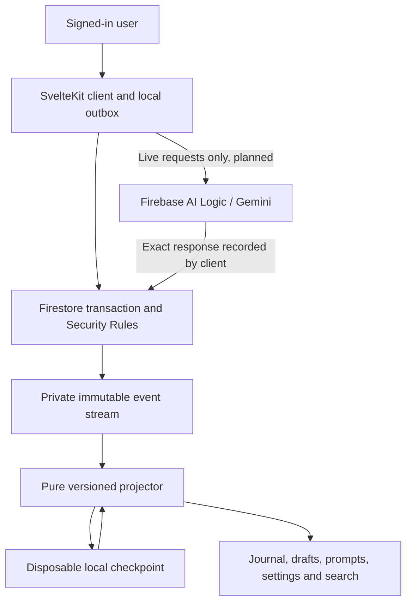

# Gratitude MVP design

This proposal defines the first usable Gratitude application, following [UX_DESIGN.md](UX_DESIGN.md). The backend is Firebase, users authenticate with Google, and Gemini supplies daily prompts and photo summaries. [IMPLEMENTATION_PLAN.md](IMPLEMENTATION_PLAN.md) sequences the work. The current branch implements the first Firebase foundation described below.

## Implemented foundation in PR #4

The `/journal/` route implements Google sign-in, save/edit against a fixed versioned starter prompt, a private ordered Firestore stream, live subscriptions, a checksummed IndexedDB projection checkpoint, and a durable pending-save outbox. A second browser can reconstruct the same journal. Recovery discards the checkpoint and replays all events. Browser transactions, Security Rules validation, idempotent retries, revision conflicts and owner-only access are emulator-tested. Live provisioning is tracked in [FIREBASE_SETUP.md](FIREBASE_SETUP.md).

This slice uses `ReflectionWritten` with entry ID, original text, expected revision and starter ID. Sequence and server timestamp are infrastructure metadata; prompt text, entry revision and rainbow position are derived. The stream head and per-entry last-event pointer are transactionally maintained append indexes, reconstructable from the event stream. Rules derive the expected revision from the prior immutable event; no entry snapshots are stored in these indexes. Missing/damaged cloud indexes require controlled repair, while local projection caches can be discarded by the user. The complete MVP event vocabulary below remains planned; preserve or explicitly migrate this first schema when extending it.

No AI requests or AI events are implemented yet. There is no daily-entry reservation, autosaved draft, service worker, persistent local event cache, photo pipeline, search, export or erasure flow. Offline recovery currently means preserving a failed explicit save for retry; cold offline startup is not supported. Storage rules deny all access until the photo increment. The initial journal is a functional foundation, not the complete approved UX.

## Event-sourcing contract

**The source of truth is the ordered event stream: user actions plus recorded external AI responses. Projections contain application state and can always be rebuilt. Replay never calls Gemini.**

The user's clarification establishes AI responses as external facts that belong in events. They are not locally computed journal state. Entries, draft status, palette positions, search indexes, counts, and effective personalization context remain derived values and must not be copied into events as state snapshots.

A prompt or image summary is generated once during live processing, durably recorded, and subsequently read from its event. Neither a new device nor a cache rebuild needs the original model, model weights, API availability, or a repeated generation request. A later change of model affects new requests only. This replaces the earlier deterministic-inference proposal and its proposed loss of dependent prompts after source-data deletion.

## Product and deployment

The MVP includes Google sign-in, optional onboarding, daily prompts and alternatives, skipping/resuming, durable drafts, save/edit, freeform feedback, photos with editable summaries, rainbow history, local search, AI controls, and Markdown/JSON export. Signing in to the same Google account on another device restores the same user-owned journal from Firebase.

Today, Journal, and Settings remain the three tabs; AI settings is the first Settings row. Preserve the dark glass, yellow accent, ink background, prompt-visible cards, stable daily colour, common collapsed-card height, and accessibility rules in the UX. Add Google sign-in before opening the cloud journal; onboarding answers remain optional. Provide clear sign-in cancellation, expired-session, sign-out, and account-switch states. A separate guest journal and anonymous-to-account migration are outside the MVP.

| Component | Responsibility |
| --- | --- |
| GitHub Pages | Static SvelteKit production application and per-PR previews |
| Firebase Authentication | Google sign-in; stable Firebase UID for journal ownership |
| Cloud Firestore | Authoritative per-user event stream and atomic append indexes, protected by Security Rules |
| Cloud Storage for Firebase | Private, metadata-stripped photo assets referenced by events |
| Firebase AI Logic (planned) | Managed Gemini access from the client; responses recorded as events |
| IndexedDB | Confirmed-event cache, versioned local projection checkpoints, pending user-action outbox and photo staging |
| Service worker | Base-path-scoped application assets for previously loaded offline use |

Production uses `gratitude-drbrrl`; PR previews use `gratitude-drbrrl-dev`. Both have Google authentication and Sydney Firestore. CI explicitly selects their public SDK configuration; no Gemini secret enters the build. No Cloud Functions are required for the journal foundation. Firebase AI Logic, photo storage and their quotas/billing conditions must be assessed when those features are implemented.

IndexedDB is namespaced by project, UID, stream generation and deployment base path. Namespacing and separate backend projects are not a browser security boundary between scripts on the shared GitHub Pages origin; use preview accounts/test data and consider separate origins before production release.

## Reference patterns

[Food's MVP design](https://github.com/anicolao/food/blob/578663f1204a9064de47dd63eda7a143c38288a6/MVP_DESIGN.md) records nondeterministic AI responses as events, then derives read models. Gratitude follows that boundary directly. Its [store](https://github.com/anicolao/food/blob/578663f1204a9064de47dd63eda7a143c38288a6/src/lib/store.ts) and [IndexedDB repository](https://github.com/anicolao/food/blob/578663f1204a9064de47dd63eda7a143c38288a6/src/lib/db.ts) illustrate separate event persistence and incremental projections.

[Jaipur's event types](https://github.com/anicolao/jaipur/blob/76cc8bcaa8d4f111c2ebc26b67162ca646b4576a/src/lib/game-events.ts) and [Firebase repository](https://github.com/anicolao/jaipur/blob/76cc8bcaa8d4f111c2ebc26b67162ca646b4576a/src/lib/game-repository.ts) inform versioned reducers, authenticated streams, pending actions, and cached recovery. Gratitude adds an explicit projection checkpoint and transactionally allocated sequence rather than replaying all cached events on each launch or relying on client clocks for cross-device order.



The projector has no Gemini client and no effect-dispatch API. Live user-request processing is separate from subscriptions, hydration, and replay.

## Identity, authorization, and data layout

Enable Google in Firebase Authentication and register the production application's authorized domain. Use Firebase's supported popup/redirect flow and validate redirect behaviour on the mobile browsers being supported. Journal ownership uses `request.auth.uid`, never an email or a UID supplied by the caller. [Firebase Google sign-in documentation](https://firebase.google.com/docs/auth/web/google-signin)

Proposed paths:

```text
users/{uid}/streams/{generation}                 # ordered head and integrity metadata
users/{uid}/streams/{generation}/events/{eventId}
users/{uid}/streams/{generation}/entries/{entryId} # last-event pointer for append validation
users/{uid}/assets/{assetId}                     # upload/erasure bookkeeping
Storage: users/{uid}/{generation}/{assetId}
```

The active generation is repository metadata, changed during whole-journal deletion to prevent stale offline devices restoring an erased history. Settings that must survive journal deletion remain in a separately scoped user-settings stream. Replay merges that scope using explicit referenced settings revisions, not an unspecified interleaving of two streams.

Firestore rules permit a Google-authenticated user to read only their own stream. A browser transaction creates one event and advances the head and entry pointer atomically. Rules independently validate the exact action schema, ownership, next sequence, expected revision, server timestamp and all cross-document links using `getAfter`. Event updates/deletes and unrelated collection writes are denied. The client cannot bypass these checks by modifying JavaScript. [Atomic transactions and Rules](https://firebase.google.com/docs/firestore/manage-data/transactions)

Storage is currently denied entirely. The photo increment needs owner-scoped rules and explicit upload/cleanup design. Firebase AI Logic will need App Check and quota controls; it is not enabled in this foundation. Future AI responses written by the client are user-owned records, not server-attested evidence of a provider response. Replay requires the recorded text, not an attestation. The current rules reject all unimplemented event types, including AI results.

## Events and computed state

A committed record carries `eventId`, `schemaVersion`, `rulesVersion`, `source` (`user` or `gemini`/service outcome), `type`, typed `payload`, causation/request references, observed client time/timezone where relevant, and transactionally allocated sequence/time. Identity, sequence, versions, integrity hashes, and transport bookkeeping are infrastructure metadata rather than derived journal state.

| Events | Persisted facts/inputs | Projection output |
| --- | --- | --- |
| `AnswersSubmitted`, `AnswersCleared`, `AIChoicesConfirmed`, `PersonalizationResetRequested` | Explicit answers and choices; confirmation references | Effective settings, allowed context sources and remembered feedback |
| `DayOpened`, `PromptRequested`, `AnotherPromptRequested`, `StarterPromptChosen` | Interaction time/timezone, target/request identity, user's discard choice or starter reference | Day identity, reserved colour, active request and draft binding |
| `PromptResponseReceived` | Exact Gemini prompt text, request ID, actual model identifier, response/finish metadata and outbound-context provenance | Displayed prompt, explanation of source use, request completion |
| `AIRequestFailed` | Request/attempt ID and sanitized observed provider/transport outcome | Retry/fallback availability, without invented prompt text |
| `DaySkipped`, `DayResumed`, `ReflectionWriteOpened`, `ReflectionEditOpened` | User-selected day/entry/prompt references | Navigation-independent daily state and editable draft |
| `DraftTextChanged`, `ReflectionSaveRequested` | Literal user-entered text and target revision, or save reference | Saved entry, dirty state, word counts |
| `PromptFeedbackSubmitted`, `PromptFeedbackRemoved` | Prompt reference and literal feedback, or feedback reference | Remembered feedback and future context eligibility |
| `PhotoAttached`, `PhotoRemoved`, `PhotoSummaryRetryRequested` | User-selected private asset reference and summary choice, or target/request reference | Attachment relationships and pending summary status |
| `PhotoSummaryResponseReceived` | Exact Gemini summary text and response metadata, photo version and request ID | Image description suggestion and summary status |
| `PhotoDescriptionEdited`, `PhotoDescriptionCleared` | Explicit user edit/clear against a description revision | Manual description overriding AI suggestions |
| `ReflectionDeletionRequested`, `JournalDeletionRequested` | Explicit target/whole-journal confirmation | Tombstones and required erasure work |

AI result events retain the consumed response exactly, including safe response metadata needed to interpret it. Store bounded text/JSON responses in Firestore; never put image bytes, credentials, hidden model reasoning, or entire projected entries there. Context provenance records the actual outbound request boundary: template version, input source/revision references and enabled sources. Avoid duplicating private source text in provenance. Operational exception stacks and secrets never enter user events.

For an edited AI description, record user edit operations against the response/manual revision, not an automatic snapshot of the entry. Accepting an unchanged suggestion needs only its response reference. Starter text comes from a versioned bundled catalogue; no AI call or AI-response event is invented for it.

## Ordered writes and cross-device conflicts

The browser transaction checks the stable event ID, reads the canonical head and the entry's previous event, checks the expected revision, then appends the new event with `serverTimestamp()` and advances both indexes. Rules repeat validation independently. Identical retries return the original event after confirming its full action payload; reused IDs with changed input fail. Concurrent attempts can receive a Rules denial before the SDK retries a precondition, so the client checks for an identical committed event and makes bounded transaction retries. Text conflicts retain the pending text for explicit recovery.

Cloud head/pointer indexes are operational metadata, not independent sources of domain state. They must only advance with an event. Local projections are rebuilt through the pure reducer; cloud-index repair, if ever needed, must reconstruct from the validated full stream through administrative tooling rather than weakening client rules.

A pending draft edit and its Save action can be submitted as one ordered command batch. Sequence is authoritative; client timestamps serve only as recorded interaction context. Concurrent text edits use explicit expected revisions. A stale write returns a conflict while retaining the unsent text; the user can reload or explicitly reapply it. Do not silently apply last-write-wins to journal prose. Sync acknowledgements remove matching pending IDs once, not append duplicate events.

An offline outbox is separate from the confirmed stream and checkpoint. It contains user commands, original base revisions, generation, and stable IDs. Render a provisional overlay while offline; on reconnect, fetch confirmed changes, submit commands, and rebase or surface conflicts. Pending commands never acquire invented server sequences. An offline day colour is labeled provisional until its first cloud commit because another device may reserve a day first; once confirmed, its colour never changes. This is the explicit cross-device amendment to the original same-device colour promise.

Repeated opens for the same observed local date resolve to one canonical day. Its palette position derives from earlier canonical distinct day openings; no `ColourAssigned` event or palette payload is needed. Midnight/timezone changes do not rebind an existing draft. Two devices choosing prompts for the same day reconcile through the canonical request/day revision, not competing unversioned overwrites.

## Gemini execution and credentials

Use Firebase AI Logic for managed Gemini access from the client in a later increment. The repository's existing `GEMINI_API_KEY` remains unused and private; it must never be copied to Vite configuration or the browser. Evaluate the supported Gemini Developer API no-cost tier, quotas, App Check and data-use terms before enabling real journaling inputs. This integration does not require a custom Cloud Function. [Firebase AI Logic pricing](https://firebase.google.com/docs/ai-logic/pricing)

Live processing is separate from replay:

1. An explicit user action commits a request event with stable request identity and consent/settings references.
2. The live client reconstructs eligible context (at most five recent entries and twenty feedback items with versioned size limits), rechecks consent and calls Gemini outside any Firestore transaction. Use a transactional claim if coordinating multiple active devices.
3. Store the exact consumed response, actual model, request identity and context provenance in a response event. Deduplicate acceptance by stable response ID. Recheck current generation/consent/target before accepting late output.
4. Only committed response events supply the durable prompt or summary. Persist an already-received result locally for retry rather than issuing inference again merely because the event write failed.
5. An interrupted browser cannot execute background work after it closes. Show unfinished requests with explicit resume/retry; replay and subscriptions must never dispatch inference. Provider calls may repeat across crash boundaries, so do not promise exactly-once billing.

AI event schemas and Security Rules remain future work. The browser can author records only in its own account; managed model access does not make client-written response records provider-attested. Historical text remains reproducible because replay reads events, never calls a model. Late summaries cannot override manual descriptions. Removed targets and revoked sharing invalidate pending work.

## Cached projections and complete replay

The local checkpoint contains projection schema/rules versions, Firebase project/UID/generation, confirmed cursor and event ID, prefix integrity identity, and all projected journal/settings/search state. Keep pending commands outside it. Read models may include prompt and summary text because those values are recoverable from response events.

1. After authentication, compare generation and checkpoint metadata with the authoritative server head. Restore a matching checkpoint and request only events after its sequence. Validate contiguous order and deduplicate by ID before advancing the cursor.
2. Apply the confirmed tail through the same pure reducer used by a full rebuild. Commit cached events, projected state, and cursor atomically in IndexedDB. Overlay pending commands separately; a remote acknowledgement removes the overlay without duplicating its effect.
3. If the checkpoint is missing, corrupt, incompatible, or from an old generation, discard that checkpoint and rebuild from Firestore in pages. Preserve compatible unsent commands for explicit reconciliation; never treat clearing a checkpoint as permission to delete an outbox.
4. A fresh second device downloads the complete relevant event history and assets after Google sign-in, constructs its projection, and then follows the tail. A warm device does not replay or download the whole stream on each launch.
5. Changing a reducer/schema version invalidates incompatible checkpoints. Preserve input interpretation through explicit pure upcasters; unknown versions stop with an incomplete-history message rather than silently hiding entries.

Required equality: `replay(allConfirmedEvents) == resume(checkpointAtK, confirmedTailAfterK)` for the same rules and retained assets. Compare canonical logical state, excluding network progress, object URLs, and cache bookkeeping. Delete every local/server projection and rebuild from the canonical event streams plus photo inputs; the same prompts and summaries must return with the Gemini adapter replaced by one that throws on every call.

Event timestamps and server sequence are fixed observations, not reads of the current replay clock. Loading, incomplete sync and missing assets are explicit; they must not appear as an empty journal or zero search results. Sign-out/account switching stops listeners, discards in-memory private views and separates pending commands by UID; pending data is never uploaded to the next account.

## Photos, export, deletion and offline use

Photos use the UX's limits (JPEG/PNG/WebP, four per entry, 10 MB each), stripped metadata and normalized orientation. Stage locally before uploading to the authenticated private Storage path. Storage and Firestore cannot share one transaction: finalize an attachment event only after verifying its immutable object exists and belongs to the UID. Keep failed uploads staged for retry and clean abandoned uploads. A device-only photo is labeled pending until cloud finalization. Saving a photo-only reflection does not wait for Gemini summarization.

Search is a disposable local index over full saved prompts, responses and accepted/manual summaries. Exports use a consistent fully synchronized head and include the UX's Markdown/JSON/ZIP content, independent of search. Offer synchronization before an export labeled “All saved reflections”; do not silently substitute a partial cache. Computed colours and counts are appropriate in exports, which are read models rather than source events.

Deleting an input no longer requires discarding another entry's historical prompt: the response event preserves the exact output independently. Deletion must still erase the selected entity's own text, photos and response events/private payloads. A tombstone alone does not remove historical private content. Implement restart-safe scoped erasure with retained non-sensitive deletion/ordering metadata, a generation/invalidation mechanism for all caches, and verified cleanup of operational request data. Replay reconstructs the current post-deletion state from surviving events and tombstones, not pre-deletion private content. Whole-journal deletion advances its generation while retaining explicit answers in the settings scope; personalization reset clears its answers/remembered feedback and disables the sources while existing journal prompts remain recorded.

A disconnected device cannot be remotely wiped immediately. On reconnection it must check generation/erasure metadata before rendering a stale cloud cache or submitting its old outbox, purge erased scopes, and require explicit reconciliation of rejected commands. UI must distinguish device cleanup, server completion, and pending other-device synchronization. Explain that prior exports and provider retention are outside app-managed deletion; do not promise to retract Gemini requests already sent.

Previously loaded offline users can read cached entries, search the available journal, and queue user edits. Show “Saved on this device; waiting to sync” separately from “Synced.” First sign-in and Gemini generation require connectivity; provide the labeled bundled starter path offline. Consent disclosures identify Gemini and the actual fields sent, with separate photo processing and journal-context choices. Complete reconstruction requires the cloud stream when the local event cache is incomplete, but never needs Gemini.

## Provisioning and implementation status

The Firebase project, Google provider, Firestore database, planned private Storage bucket, rules and optional deployment identity are tracked in [FIREBASE_SETUP.md](FIREBASE_SETUP.md). The setup record distinguishes verified resources from pending configuration. Google login authorized provisioning; billing is not required by this journal foundation. The setup inventory distinguishes provisioned resources from verified application behavior.

The implementation plan now starts with Firebase/authentication and recorded external-response events. There is no deterministic-model feasibility gate, no local-only MVP scope, and no proposed separate authoritative AI artifact archive.
