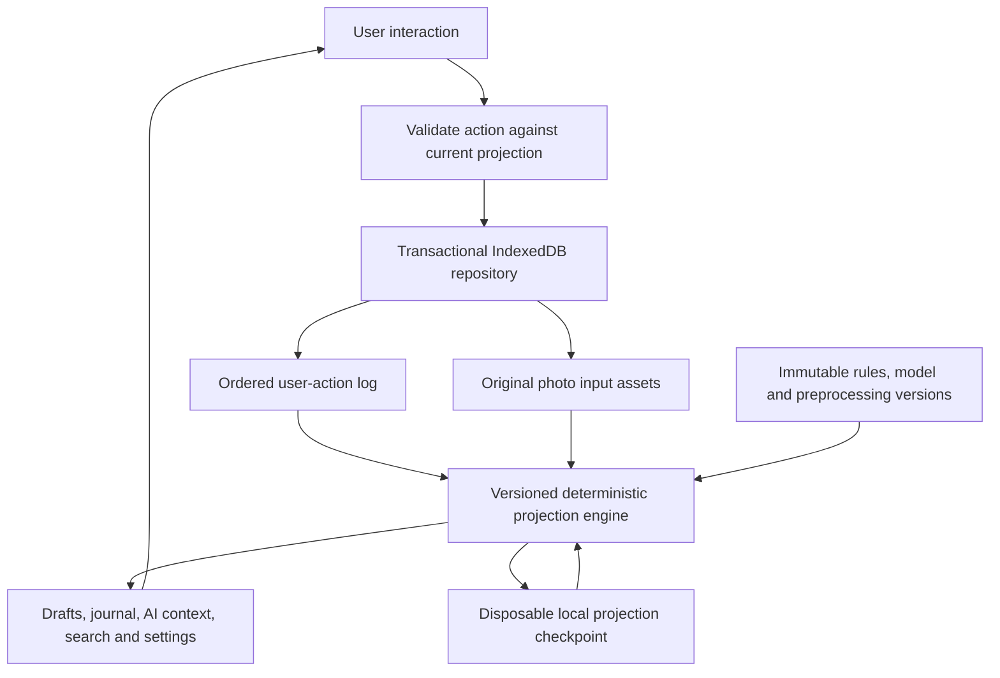

# Gratitude MVP design

This proposal defines the first usable Gratitude application. It follows [UX_DESIGN.md](UX_DESIGN.md) and the event-sourcing requirements recorded in [PROMPTS.md](PROMPTS.md). Implementation work is sequenced in [IMPLEMENTATION_PLAN.md](IMPLEMENTATION_PLAN.md). The current application is the merged SvelteKit scaffold; these are design decisions for review.

## Product scope

The MVP is a private, local-first journal on one browser installation. It provides optional onboarding, a daily personalized prompt, replacement and skipping, durable drafts, saving and editing, freeform prompt feedback, photos with editable AI summaries, rainbow history, local search, AI settings, and Markdown/JSON export. Today, Journal, and Settings are the three top-level destinations. Settings contains the AI settings row.

Use the existing dark glass, yellow accent, and ink-background design. Reserve the day's colour before writing; display the prompt on both drafts and saved entries. Collapsed journal cards share the prescribed height and reflow consistently for enlarged text. No streaks, mandatory onboarding answers, or inferred sensitive user profiles.

Proposed deployment: retain the static SvelteKit client on GitHub Pages, add IndexedDB storage and a service worker for previously installed application assets. Accounts, cross-device synchronization, shared journals, hosted AI credentials, and import are outside this first release. Browser storage is the journal store, not a backup. Explain that clearing site data removes it and offer exports. This scope choice needs review alongside the AI feasibility gate below.

## Architectural invariants

1. **Events contain user actions only.** Persist what the user entered, selected, requested, corrected, or explicitly confirmed. Never persist a result of applying that action in its event.
2. **All application state lives in projections.** Entries, drafts, settings, prompt text, image summaries, personalization context, colour assignments, search indexes, and job eligibility are derived. No component or background worker can author a competing journal state.
3. **Every projection is disposable.** A complete replay from the retained action history and original input assets, using the preserved implementation versions, reconstructs the same logical state. A projection checkpoint is never an authoritative backup.
4. **Incremental and complete replay use the same projection functions.** Restoring a valid checkpoint and applying the remaining actions must equal replaying from the beginning.
5. **Replay has no external effects.** It does not append actions, send requests, emit notifications, or export files. It does not read the current clock, network responses, mutable model aliases, or unseeded randomness.
6. **A successful save means a committed local action.** In-memory changes, an optimistic screen, or a computed projection alone do not constitute durable saving.

"User actions only" rules out `PromptGenerated`, `PhotoSummarized`, `EntryStateUpdated`, `ColourAssigned`, `SearchIndexed`, and `PersonalizationComputed`. Renaming a model response to `UserAcceptedPrompt` and copying its text into that payload also violates the rule. Acceptance records a reference to the suggestion being accepted, not its computed contents.

## Reference implementations and deliberate differences

| Reference inspected | Pattern carried into Gratitude | Difference required here |
| --- | --- | --- |
| [Jaipur event types and lobby reducer](https://github.com/anicolao/jaipur/blob/76cc8bcaa8d4f111c2ebc26b67162ca646b4576a/src/lib/game-events.ts) | Typed actions, explicit schema/rules versions, state derived from actions | Use a closed payload union and reject unsupported histories visibly; do not silently omit unknown actions and present a complete journal. |
| [Jaipur game rules](https://github.com/anicolao/jaipur/blob/76cc8bcaa8d4f111c2ebc26b67162ca646b4576a/src/lib/jaipur-rules.ts) | Seeded, repeatable computation of state from action inputs | AI inference must meet the same deterministic requirement; storing a seed alone does not make a hosted model repeatable. |
| [Jaipur repository](https://github.com/anicolao/jaipur/blob/76cc8bcaa8d4f111c2ebc26b67162ca646b4576a/src/lib/game-repository.ts) | Separate persistence, ordering, pending work, and derived views | Its event cache is not a projection checkpoint. Gratitude explicitly caches versioned projections and replays only the tail. |
| [Food store](https://github.com/anicolao/food/blob/578663f1204a9064de47dd63eda7a143c38288a6/src/lib/store.ts) and [IndexedDB repository](https://github.com/anicolao/food/blob/578663f1204a9064de47dd63eda7a143c38288a6/src/lib/db.ts) | Local persistence and incremental projection application | Do not copy complete entry/analysis objects into action payloads or maintain settings outside replay. |
| [Food MVP design](https://github.com/anicolao/food/blob/578663f1204a9064de47dd63eda7a143c38288a6/MVP_DESIGN.md) | Distinguishes the event source from read models | Its `aiEstimateReceived` result event is expressly excluded by Gratitude's stricter contract. |

## Boundaries and data flow

Use TypeScript domain modules independent of Svelte. The command boundary validates intent; the repository handles transactions and identities; the projection engine owns domain decisions. Svelte renders projection selectors and keeps only ephemeral interaction state such as focus, an unsubmitted input buffer, an open dialog, or the current search query. These transient details are not part of the durable replay guarantee.

## Actions, identities, and ordering

The domain event is `{ id, schemaVersion, rulesVersion, type, input, context }`. `input` is an exact typed user action. `context` captures the observed interaction timestamp and IANA timezone at the boundary. Those observations and immutable version identifiers are replay inputs, not derived journal values. Entity references identify things the user acted on. New entity identities derive from the creating action's ID; no generated entry snapshot is recorded.

IDs, storage sequence numbers, encryption nonces, checksums, and schema identifiers are infrastructure metadata, not computed domain state. Store the monotonically increasing sequence alongside the event in its database row; never include projected counts, palette indices, selected context, AI output, or state hashes in the domain payload. Validate schemas with unknown fields rejected.

For the single-installation MVP, an IndexedDB read/write transaction allocates the next sequence and inserts the unique action ID. Sequence, not wall-clock time, determines order. Multiple tabs serialize through the repository transaction, verify the expected head before accepting a stale edit, and notify one another after commit. A retry uses the same action ID and payload; an identical duplicate is acknowledged once and a different payload with that ID is an error. Stale edits retain the user's text and offer reload/reapply rather than overwriting silently. Multi-device ordering is a future design problem, not an implied capability.

| User action | Allowed input | Projection consequences; never event payload |
| --- | --- | --- |
| `OnboardingAnswersSubmitted`, `AnswersChanged`, `AnswersCleared` | Explicit selected answers, or no fields for clear | Effective answers and prompt context |
| `AIChoicesConfirmed`, `PhotoSummaryChoiceChanged` | Explicit chosen switches | Eligible sources and queued-work eligibility |
| `DayOpened` | Observed time and timezone in context | Local date, day identity, next reserved palette position, initial prompt request |
| `ReflectionWriteOpened`, `StarterPromptChosen` | Day and chosen prompt-request or bundled-starter reference | Draft bound to the exact chosen prompt; no copied prompt text |
| `AnotherPromptRequested`, `DaySkipped`, `DayResumed` | Day reference; explicit discard-draft choice where applicable | Replacement ordinal, skipped status, retained or discarded draft |
| `DraftTextChanged` | Day/entry reference and literal user-authored replacement text | Current draft, dirty state, word counts |
| `ReflectionSaveRequested`, `ReflectionEditOpened` | Target reference only | Saved entry from the prior draft; same entry identity on edit |
| `PromptFeedbackSubmitted`, `PromptFeedbackRemoved` | Prompt reference and literal feedback, or feedback reference | Remembered feedback and eligible future context |
| `PhotoAttached`, `PhotoRemoved` | Target and selected original input-asset reference; explicit summary choice | Attachment list, summary request identity and eligibility |
| `PhotoSummaryRetryRequested`, `PhotoSummaryAccepted` | Photo/request reference | Retry request or accepted summary reference |
| `PhotoDescriptionEdited`, `PhotoDescriptionCleared` | Photo/base-description reference and user edit operations (selected range and inserted literal text), or clear reference | Manual description takes precedence over AI output |
| `PersonalizationResetRequested` | Explicit confirmation only | Cleared answers/feedback, disabled personalization sources |
| `ReflectionDeletionRequested`, `JournalDeletionRequested` | Target reference or explicit whole-journal confirmation | Deleted entities and required erasure work |

Editing an AI description records only the user's edit operations against an identified base; do not serialize unchanged generated text back into an event as part of a whole-field replacement. A description written from an empty base can contain the complete user-authored text.

An autosaved draft action represents the user's edit, not an automatic snapshot of the entire draft projection. Coalesce uncommitted typing, flush on blur/save, and distinguish the input buffer from the last committed text. A save first commits any pending edit, then the save action in the same transaction. Auto-resume of already authorized work does not create a synthetic user event.

`DayOpened` corresponds to the user's initial or renewed visit to Today. Repeated opens on the same derived date reuse the existing day. Date derivation uses the observed time/timezone and pinned date rules, never the replay machine's current timezone. Reserve the next palette position from the number of prior distinct opened days; replacement, editing, filtering, and deletion do not advance it. Colours exist only in the projection. A draft retains its originating day across midnight.

## AI output and exact replay: release gate

The strict proposal assumes **no separately authoritative AI-response archive**. Storing generated text only in a checkpoint would make that checkpoint indispensable. Re-requesting a hosted model would not reproduce the original prompt reliably, including with temperature zero or a seed. Either approach fails the stated replay contract.

The proposed compatible route is deterministic local inference, executed as part of projection computation in a worker:

- Preserve immutable model weights, tokenizer, preprocessing, prompt templates, inference runtime, and decoding rules by content identity. A rules version maps to that complete bundle; never silently substitute a newer model.
- Use a canonical deterministic CPU/WASM execution path and deterministic decoding. GPU-dependent inference is not the reference replay path. Prove identical output across supported environments before adopting a model/runtime.
- Derive request identity and any seed from the originating user-action ID. Derive the model input from the projection **at that action's sequence**, not from later answers or entries. Replay can therefore reconstruct the actual context behind an old prompt.
- Personalization initially means explicit answers and remembered feedback supplied to future prompts, with saved-entry context only when enabled. No fine-tuning, hidden inferred traits, or separately authoritative model memory. Select at most the five most recent eligible saved entries and twenty most recent eligible feedback items at the request boundary, using sequence order and deterministic input-length limits defined by the bundle.
- Image summarization uses a pinned image preprocessing and vision model pipeline. The selected photo bytes are user input assets. Model-generated summaries, embeddings, thumbnails, and selected context are projection data, never events.
- Cache completed AI projection nodes by rules version, request identity, and input fingerprint. Removing every such cache must still allow recomputation. Inference scheduling and progress are transient; the computed result and user decisions define settled domain state.

Computation timing must not decide durable state: user references such as opening a reflection with a particular prompt or accepting a photo summary bind the chosen request. Unaccepted obsolete results are discarded consistently after replacement or revoked eligibility, whether or not a worker happened to finish earlier. Tests must permute worker completion order and confirm the same settled projection for the same action sequence.

No suitable model/runtime has been selected or measured. The MVP may not claim AI completion until prompt quality, mobile resource use, vision support, and exact replay pass the first implementation gate. Preserve historical bundles for retained histories; absence of a required bundle is an explicit incomplete-rebuild state, not permission to change old text. A bundled deterministic starter prompt allows writing when AI is unavailable, but does not satisfy the AI feature's acceptance criterion.

An alternative for review is immutable AI response artifacts outside the event log. That would keep events user-action-only, but full replay would require those additional authoritative computed artifacts. It changes the strict proposal and must be explicitly accepted before a hosted-model implementation is planned. This document does not quietly treat it as a disposable cache.

## Projection shape and cache protocol

The logical projection contains settings and explicit personalization memory; opened days and reserved colours; prompt requests and results; drafts; saved entries; attachment relationships and summaries; deletion state; and search data. Saved entries reference the original prompt request and derive their displayed prompt from it. Manual photo text wins over late results. A removed/replaced photo or revoked authorization makes pending work ineligible. Save does not wait for summarization once the photo input is durable.

Persist a checkpoint containing the projection schema/rules version, journal generation, last applied sequence and action ID, verified prefix fingerprint, asset manifest version, and projected state. Computed metadata belongs here or in repository indexes, never in action payloads. Each checkpoint declares its completed AI nodes and unresolved derivations; do not advance a dependency's completion marker until its result is durable.

Startup and recovery:

1. Read the log head and a checkpoint in a consistent transaction. Verify its versions, generation, prefix identity, and required input assets. Fast validation uses transaction-maintained integrity metadata; it does not read/reduce the complete prefix on each startup.
2. If valid, hydrate the cached projection and apply actions after its cursor through the same versioned functions used by full replay. Reuse valid completed AI nodes and schedule unresolved nodes. UI distinguishes loading/incomplete reconstruction from an empty journal.
3. If missing, corrupt, ahead of the log, or incompatible, discard the checkpoint and rebuild from sequence one in a worker. Never delete the user-action source to repair a projection. An unknown event version stops at a clearly identified incomplete history.
4. Commit each ordinary action and its immediate projection/cursor update atomically. Expensive deterministic inference runs outside that transaction and installs a cache result only if its input identity still matches. No computed-result event is appended.
5. A crash after an action commit but before an AI cache write leaves derivable pending work. A crash during checkpoint replacement leaves either the old complete checkpoint or the new one. No partially advanced cursor is valid.

Rules that define historical semantics remain available. Changing the projection representation invalidates its checkpoint; changing an AI bundle applies to new actions using a new rules version. Pure schema upcasters may translate input structure but must not enrich an event with computed business values.

The principal test equation is `settle(replay(allActions)) == settle(resume(checkpointAtK, actionsAfterK))` for every tested split point, with identical original assets and version bundles. Compare canonical logical state, excluding elapsed time, worker progress, object URLs, and cache bookkeeping. Also rebuild after deleting **all** projection and AI caches to prove there is no hidden source of truth.

## Photos, privacy, and deletion

Ingestion accepts the UX's JPEG/PNG/WebP limits (four per entry, 10 MB each), normalizes orientation and strips metadata before retaining the selected input copy. The ingestion format is versioned; replay uses those retained input bytes, not a second transformation of a missing original. Bytes and their `PhotoAttached` action must become durable together before showing success. An input asset is user-provided material, not a generated summary. Derived thumbnails are disposable.

Local inference sends no answers, feedback, entries, or photos to an AI service. Update the implementation disclosure accordingly while retaining the separate personalization and photo-processing choices. Do not display the mockup's remote-upload disclosure for a local model. A future remote provider requires a separate data-sharing decision.

Appending deletion actions while retaining plaintext history does not erase private text. Proposed erasure uses scoped encryption for sensitive action inputs and original photo assets, with separately deletable per-entry and personalization keys. Keep minimal non-sensitive action identities, target references, and ordering metadata available to reconstruct deletion tombstones and the stable day/colour sequence. Whole-journal deletion preserves explicit answers as the UX requires; personalization reset erases its answers/feedback scope separately.

There is an additional dependency constraint: an older answer, feedback item, or journal entry may have influenced a prompt retained on another entry. Erasing that input makes exact recomputation of the dependent prompt impossible. The strict proposal therefore invalidates those dependent AI results in both the live projection and full replay and displays “Prompt unavailable after source data was deleted,” while preserving the surviving entry's user-authored text. This is a proposed UX amendment requiring review, not a claim that the original prompt remains reproducible. Conservatively invalidate every historical AI request whose eligible context prefix intersects an erased scope; do not rely on a now-missing cached context-selection result to discover dependencies. Subsequent prompts use the surviving inputs.

If preserving every original prompt after erasing its source data is required, the strict source-only design cannot meet that requirement without retaining the result or its original inputs. Resolve that tradeoff explicitly at the first implementation gate; an immutable computed artifact archive would change the source contract.

Full replay first identifies erased scopes from retained deletion actions before decrypting content actions, then reconstructs only the surviving state. Cache invalidation includes every affected request dependency, not only the deleted entry row. This prepass is required after erasure or complete rebuild; ordinary warm starts use the matching generation and cached erasure projection.

Before releasing deletion, prove that a replay can skip erased scopes and reconstruct the **current post-deletion state** from surviving action metadata without their content or an old checkpoint. It cannot and must not resurrect erased content or reproduce pre-erasure private states. A deletion request is the user event; key-removal bookkeeping is storage infrastructure, not a synthetic domain event. Resume incomplete erasure on restart, clear every affected projection/cache/asset, and show success only after the managed stores confirm removal. This is app-managed erasure, not a promise of forensic deletion from browser backups or previously downloaded exports.

## Search, export, and offline behaviour

Search is a derived local index over full saved prompt, response, and accepted/manual summary text. Apply the UX's case/accent-insensitive, all-query-words matching and newest-first ordering without persisting search queries as domain events. Rebuild the index from the same projection after cache loss. Loading or incomplete reconstruction must not appear as zero matches.

Export reads a consistent settled projection at a captured action-log head. Include all saved entries and the personalization appendix specified in the UX, including stable IDs and derived palette indices. Computed values are appropriate in exports because exports are read models, not event logs. Markdown/JSON plus photos in ZIP remain the user-facing formats; exclude unsaved drafts and credentials. These readable exports are not a full event-history backup or an implied import format.

Cache application assets within the deployment's base path. Production and PR preview installations use separate database/cache namespaces to avoid accidentally opening the production journal in a preview. Previously loaded models and retained assets support offline work. Missing model assets yield a labeled starter-prompt path; storage failures retain uncommitted writing and offer copy/retry. Never call a local draft synchronized or guarantee recovery after browser storage is cleared.

## Review decisions

Review the single-installation scope, deterministic local AI feasibility gate, and scoped-erasure design before implementation. If an external response archive is preferred, revise the replay source contract explicitly. The action-only rule, disposable projections, stable replay, and generated screenshot E2E evidence remain requirements, not optional implementation shortcuts.
