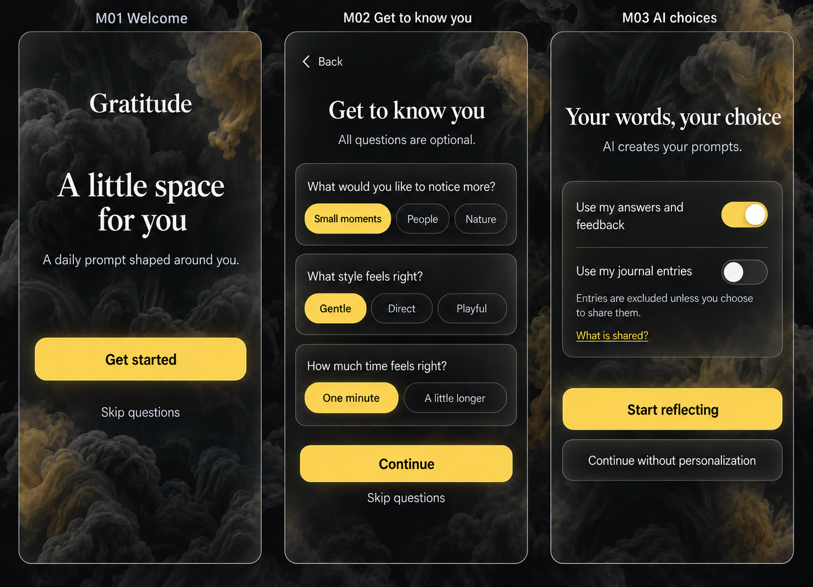
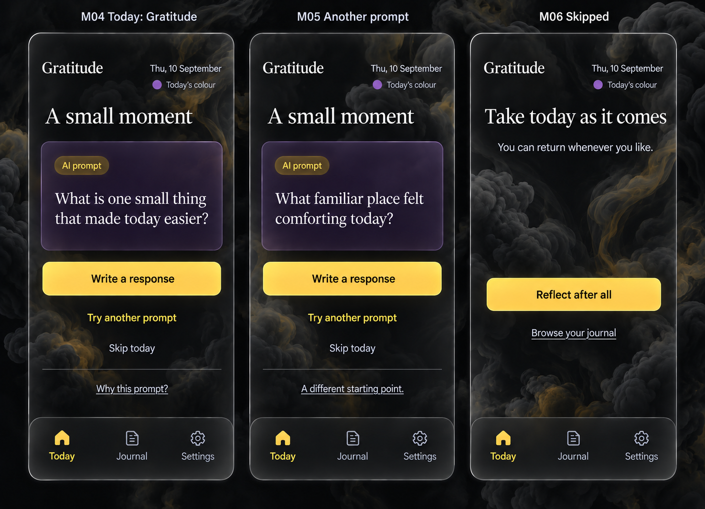
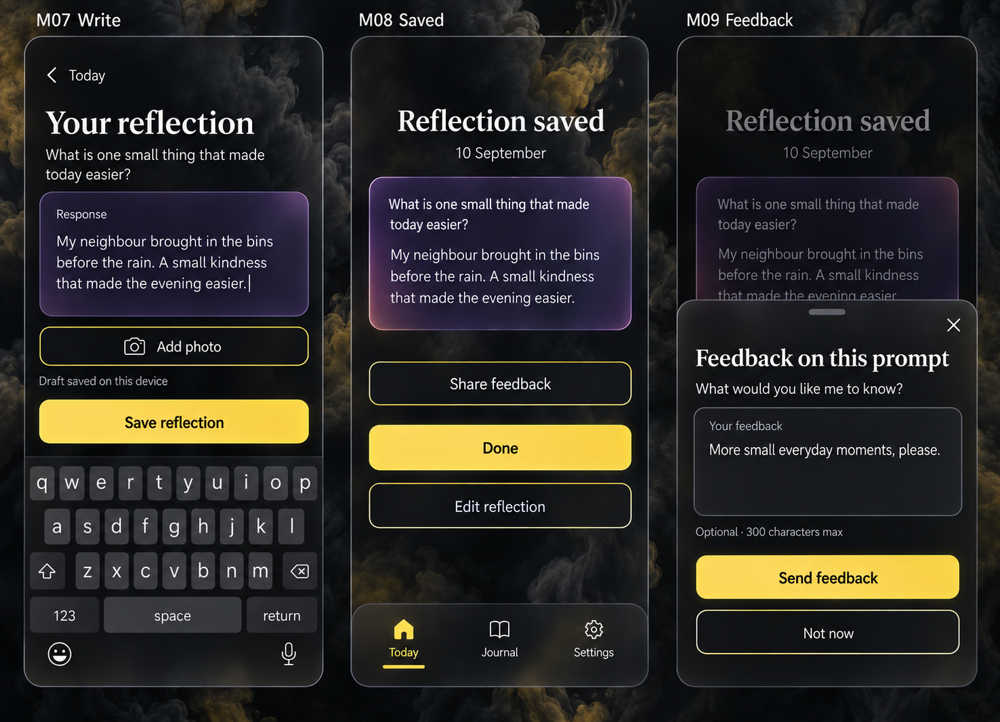
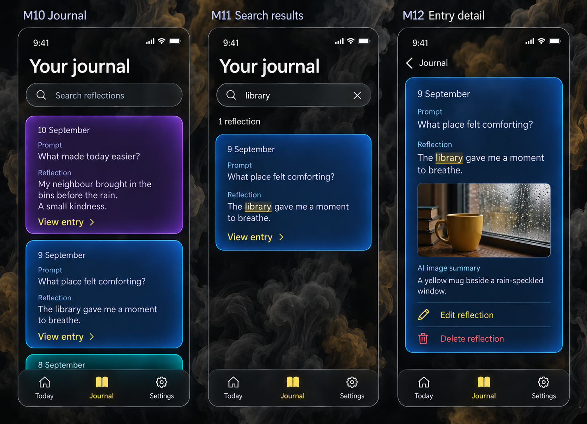
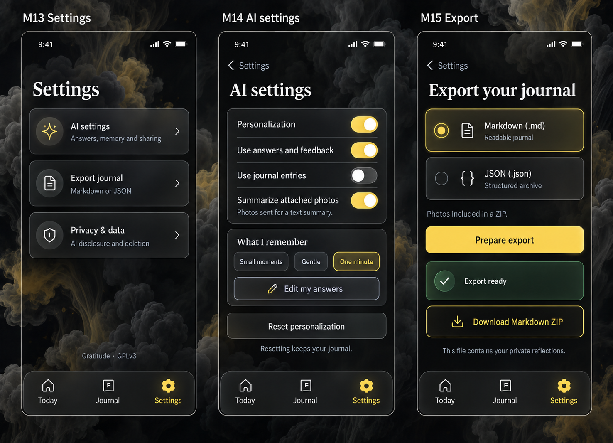
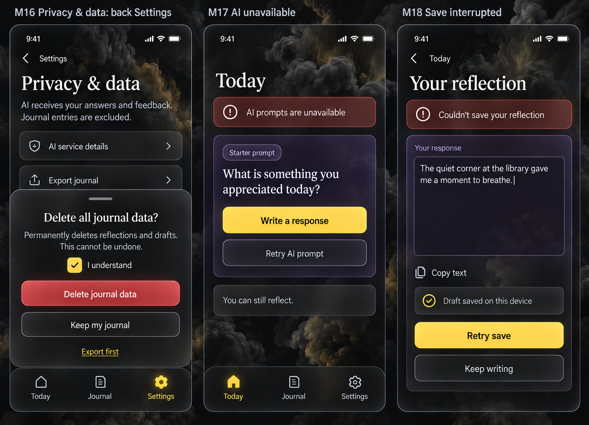
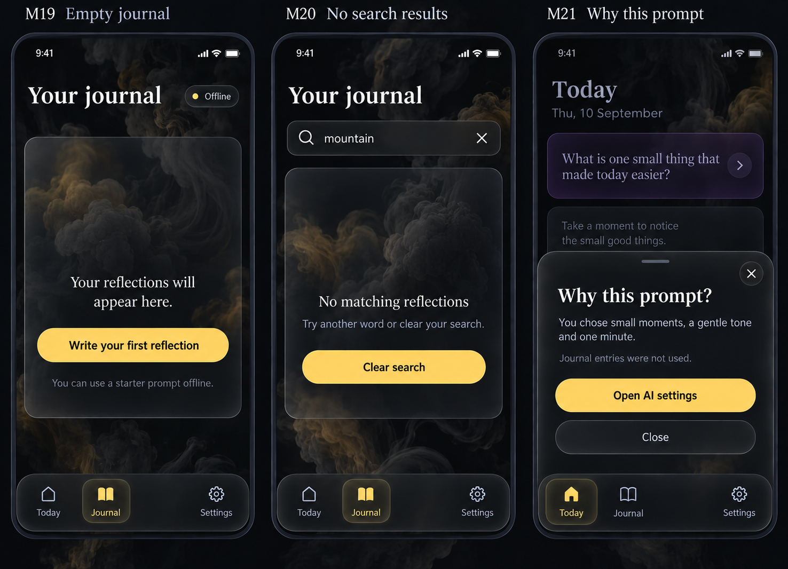
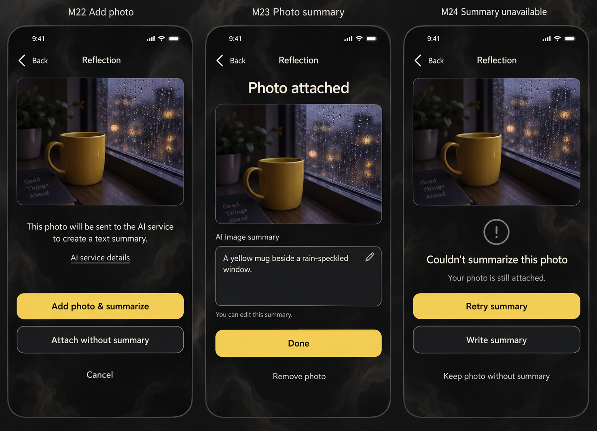

# Gratitude mobile UX design

Gratitude is a dark-mode-only mobile SPA with frosted glass surfaces and a rainbow journal. This proposal contains eight image-generated boards covering twenty-four screens. The written rules define behavior; the raster mockups illustrate appearance and are not a working application.

## Navigation and daily flow

The three persistent, labeled tabs are **Today · Journal · Settings**. Settings lists AI settings directly as its first row. AI settings is a Settings subpage with a labeled Back control, not a separate navigation tab. The main daily route is Today → Write → Saved. Writing hides the bottom bar to make space for the text and keyboard.

Users sign in with Google before opening their Firebase journal. First-time users then see Welcome → optional questions → AI choices → Today. Returning signed-in users arrive at Today. Account switching, sign-in cancellation, and expired sessions retain clear recovery paths; the account is identified by Firebase UID across devices. The existing boards predate this sign-in screen; [MVP_DESIGN.md](MVP_DESIGN.md) specifies its behaviour. The same local calendar date retains its prompt and draft across refreshes. Requesting a replacement is explicit. A reflection retains the prompt and date it was started with, including across midnight. Skipping is reversible and creates no journal entry. There are no streaks or missed-day penalties.

## Core stories

| Story | Screens | Outcome |
| --- | --- | --- |
| Let the AI get to know me | M01–M03 | Answer optional questions and choose what informs prompts. |
| Receive, replace, or skip a daily prompt | M04–M06 | Reflect at my own pace. |
| Write, preserve, save, edit, and give feedback | M07–M09, M18 | Save a reflection and optionally send short freeform prompt feedback. |
| Attach photos and receive an AI image summary | M07, M22–M24 | Add a photo, review its text summary, and recover from a failed summary. |
| Browse a colourful journal and read an entry | M10, M12 | Scan large uniform cards and open the full text. |
| Search my reflections | M11, M20 | Find matches in full saved text and recover from no results. |
| Reach settings and control AI | M13–M14, M21 | Inspect answers, memory, and sharing through the first Settings row. |
| Export Markdown or JSON and delete journal data | M15–M16 | Take a readable or structured copy and manage stored entries. |
| Reflect through failures or an empty journal | M17–M19 | Use a starter prompt and recover writing without false success. |

## 1. Onboarding

- **M01 Welcome:** Get started opens M02; Skip questions opens M03. Google sign-in provides account access before this flow; no separate password registration form is needed. Firebase synchronizes the same user's event stream across devices.
- **M02 Get to know you:** ask three optional questions: “What would you like to notice more?” (Small moments, People, Nature; multi-select), “What style feels right?” (Gentle, Direct, Playful; single-select), and “How much time feels right?” (One minute, A little longer; single-select). The mockup depicts answers already selected. Initially nothing is selected; Continue works with any or no answers. Skip questions discards the unconfirmed selections. Back retains them within the onboarding session.
- **M03 AI choices:** Use my answers and feedback is enabled in the illustrated state; Use my journal entries is off. Start reflecting confirms the displayed choices. Continue without personalization disables both sources and still allows general AI prompts. Answers stay local until this choice is confirmed. The app does not infer answers to skipped questions or require demographic or sensitive information. Answers can be reviewed, changed, or cleared later in M14.

“What is shared?” opens the AI disclosure described under M16. Enabling entry sharing requires that disclosure and explicit confirmation before any entry text is sent. A user who skips questions still has a complete daily reflection experience.

## 2. Today and choice

- **M04 Today:** the prompt card already wears the colour reserved for today’s entry; that exact colour follows the draft and saved reflection. Write a response opens M07. Try another prompt opens M05. Skip today opens M06. Why this prompt? opens M21. After a reflection is saved, Today offers View reflection and Edit reflection for that day.
- **M05 Another prompt:** keep the date; never silently rewrite an existing reflection. If a draft exists, confirm with Keep current prompt or Replace prompt and discard draft. Failed replacement keeps the original prompt available and offers retry or a starter prompt.
- **M06 Skipped:** Reflect after all restores today's prompt or draft. Browse your journal opens M10. The next local date returns to the ordinary Today state.

Generation shows a labeled loading state, preserves any existing prompt, and prevents duplicate requests. A failure never erases writing.

## 3. Writing, saving, and feedback

- **M07 Write:** show the complete prompt above a labeled response textarea, with the reserved daily tint on the draft panel. Add photo opens M22. Attached photos appear as compact thumbnails with summary status; tapping one opens its full preview. Save reflection remains accessible above the keyboard. Allow saving when there is response text or at least one successfully attached photo; disable saving for an otherwise empty draft. Persist the draft as the user writes, and show “Draft saved on this device” only after a successful local write. Back preserves the draft. If local persistence fails, say “Draft not saved on this device,” offer Copy text, and warn before discarding unsaved text.
- **M08 Saved:** show only after successful durable saving to the selected journal store. Done returns to Today. Edit reflection returns to M07 and updates the existing entry rather than duplicating it. Share feedback opens M09. There are no helpful/unhelpful ratings, thumbs, or preset reason chips. With personalization off, explain that using feedback requires enabling the answers-and-feedback source, and ask before changing it. Do not silently enable personalization.
- **M09 Feedback:** a labeled multiline Your feedback field asks “What would you like me to know?” Feedback is optional and limited to 300 characters, with a remaining-character count while typing. The mockup shows an entered example. Send feedback is disabled for whitespace-only text; it saves the text against the prompt, acknowledges “Feedback saved,” and closes the sheet. Close and Not now dismiss without submitting; preserve unfinished feedback locally while the entry is open. Failure preserves text and offers Retry or Not now. Place Send feedback above the keyboard when focused. Feedback affects future prompts only when its source is enabled, and can be inspected or removed in AI settings.

## 4. Rainbow journal and search

### Card layout and colour

**M10 Journal** lists entries newest first. At the standard 390-pixel viewport and default text size, every collapsed card is **360 CSS pixels high** with 20-pixel internal padding and 16-pixel gaps. Every card contains the date, a labeled Prompt section, a labeled Reflection section, and a consistent View entry footer. Allocate two preview lines to the prompt and four to the response, so a short entry can often be read completely. Longer prompts or responses end with an ellipsis; View entry always opens their full text. A photo entry also shows a small thumbnail and attachment count in a reserved media row, without changing the shared card height. Photo-only entries show a short summary preview instead of an empty response block. Short responses do not shrink the card. The visible beginning of the next card signals scrolling.

Opening View entry goes to **M12**, a full, independently scrolling entry view showing date, original prompt, complete response, attached photos with their summaries, Edit reflection, and Delete reflection. Back restores the journal's scroll position and search query. The entry heading uses its date; no AI-generated or required entry title is introduced.

When a day’s prompt is first opened, reserve the next entry colour from a repeating sequence: **red → orange → yellow → green → cyan → blue → violet**. Store its palette index with the daily prompt and draft immediately, then copy it unchanged onto the saved entry and its photos’ surrounding panels. Refreshing, replacing the prompt, editing, or crossing midnight with that draft does not change it. For cross-device use, an offline reservation is provisional until the first canonical cloud commit, as specified in MVP_DESIGN.md. Once confirmed, it remains stable across devices. A skipped day can leave a gap in the sequence; returning that same day restores the reserved colour. Newest-first browsing shows the sequence in reverse, producing a rainbow as the user scrolls. The example board shows violet, blue, then cyan. Colours stay attached through edits, search, and deletion of other entries; do not recolour the list on filtering. The palette repeats after seven entries and does not encode emotion, quality, or category. Deletion may leave gaps in the sequence.

Use a distinct tinted glass fill, luminous edge, and faint glow for each card. Keep ivory text readable against every tint; yellow and orange use dark amber surfaces, not bright fills. Detail and search results reuse the same entry colour. At narrow widths or enlarged text sizes, increase the shared collapsed-card height consistently across the list to preserve controls and readable text. The 360-pixel default is not a cap on accessibility reflow.

### Search behavior

**M11 Search** is reachable through the labeled Search reflections field at the top of Journal. Search all saved prompt, response, and accepted image-summary text, not just card previews, with case-insensitive, accent-insensitive matching. Trim whitespace, split the query into words, and require every word to match somewhere in an entry. Blank input restores the full journal. Keep results newest first and retain the same card size and colour. Show a result count, a clear control, and highlights that do not rely on colour alone. If a match is outside the preview, show “Match in full entry”; opening the result reveals and highlights the matching text.

Search is ordinary text search, without sending queries or journal content to an AI service or keeping a search history. Hide the keyboard when opening a result and restore query and scroll on Back. Announce result counts after input settles without moving focus. Offline search uses available local entries and labels results “Searching entries on this device” if the journal is incomplete. Never present an incomplete cache as an authoritative search of the entire journal.

**M20** shows no matches and Clear search; it is distinct from **M19**, which represents no saved entries. A search failure preserves the query and offers Retry. Do not replace a failure with “No matching reflections.”

Delete reflection in M12 uses the M16 confirmation pattern with the single entry's date and “Delete this reflection?” wording. Cancel retains it; success returns to the same journal context. Failure keeps the entry and offers retry.

## 5. Settings, AI, and export

- **M13 Settings** is a visible destination with rows for AI settings, Export journal, and Privacy & data. AI settings opens M14 and retains the Settings tab. Export and Privacy & data retain the Settings tab and a labeled Back control. There is no theme selector: every screen is dark.
- **M14 AI settings** opens from the first row of Settings and has Back to Settings. All three bottom tabs remain visible, with Settings selected. Personalization off stops use of all personalization sources and disables their controls. “Summarize attached photos” is a separate image-processing preference; it does not enable journal context for future gratitude prompts. Its first activation requires the disclosure in M22. Stored answers remain inspectable until cleared. Edit my answers reuses M02 with current selections and Save changes / Cancel, plus Clear answers. “What I remember” shows explicit answers and remembered feedback, not inferred sensitive traits. Individual remembered feedback items can be removed.
- **Reset personalization** asks “Reset personalization? This clears your answers and remembered feedback. Your journal stays.” Reset personalization confirms; Cancel leaves it untouched. Success clears answers and memory, turns personalization and both sources off, and leaves the journal intact. Re-enabling requires choosing sources again.

### Export formats

**M15 Export** provides a radio choice of **Markdown (.md)** or **JSON (.json)**, followed by Prepare export. Markdown is the initial selection. Both export all saved reflections, regardless of the current search, with dates, prompts, complete responses, photo files and their summary text/status, stable entry IDs and palette indices, and a separate personalization section containing explicit answers and saved feedback. Unsaved drafts are excluded; the screen says “All saved reflections.”

When no photos are present, Markdown produces one UTF-8 `gratitude-YYYY-MM-DD.md` file, with a heading per dated reflection, separate Prompt and Reflection sections, and an appendix for personalization. Preserve paragraph breaks and escape user-authored Markdown syntax as literal content so embedded text cannot become unintended headings or links. JSON produces `gratitude-YYYY-MM-DD.json` with a schema version, export timestamp, entries array, and personalization object. When photos are present, either format downloads a ZIP containing that .md or .json file plus an `attachments/` folder of the saved photos. Markdown links images through relative paths and includes each image summary as text; JSON includes relative asset paths and summary fields. Strip original location metadata on attachment and export the stored copies. The UI explains “Photos included in a ZIP” and labels the ready action Download Markdown ZIP or Download JSON ZIP accordingly. Neither format depends on the visual card preview or includes service credentials. These are export formats; import is not implied.

Prepare export shows Preparing export, then Export ready with **Download Markdown** or **Download JSON**, matching the selected format and whether the file is a ZIP. The board depicts a prepared Markdown ZIP export; Prepare export then acts as regeneration. Changing format clears the ready file and requires preparation again. Errors preserve the format choice and offer Retry. Downloads contain private reflections, stated beside the action. If only a partial journal is available offline, explain that and wait for the full journal before preparing an export labeled “All saved reflections.”

## 6. Privacy and recovery

- **M16 Privacy & data:** show the active AI sources accurately. The illustrated state uses answers and feedback and excludes entries from prompt personalization. Separately, an attached photo is sent to the image-summary service only under the disclosed photo-summary choice. AI service details must identify the selected service, exactly which fields are sent, how any allowed entries are selected, and the service's retention behavior before entry sharing is confirmed. Gemini is the selected AI service, reached through authenticated Firebase backend functions. Confirm the configured service tier and its retention terms before presenting the final disclosure. Turning sharing off excludes entries from future requests and clears entry-derived context held by the app; it does not claim to retract previous requests.
- **Delete journal data** opens the depicted glass sheet. Its acknowledgment starts unchecked; the board shows the checked, actionable state. Keep my journal cancels. Export first opens M15. Success clears reflections, drafts, stored photos, summaries, pending image-summary jobs, and entry-derived context, then opens M19; explicit answers remain. Disable duplicate submission while deleting. On failure accurately report what has not been deleted, preserve the dialog, and offer retry; do not claim completion until the applicable storage locations confirm it.
- **M17 AI unavailable:** offer a bundled Starter prompt that is distinct from an AI prompt. Write a response remains usable. Retry AI prompt is available when connected and does not block reflection.
- **M18 Save interrupted:** preserve editor text and the device draft; retry must not create duplicates. Keep writing focuses the textarea; Copy text is a fallback, with selectable text if clipboard access fails. A device draft is not a synchronization guarantee. Offline writes show “Saved on this device; waiting to sync.” Cloud confirmation is distinct, and a conflict retains the user's text for resolution; this failure state covers a failed local or cloud journal commit.

## 7. Empty states and prompt explanation

- **M19 Empty journal:** Write your first reflection opens Today with a starter prompt while offline. Cached entries remain readable. An unavailable cache says “Your journal isn't available offline,” not “Your reflections will appear here.” Offline operation requires the app to have loaded and cached its assets at least once.
- **M20 No matches:** Clear search returns the full available journal, preserving card colours and sizes. The user can also edit the search field directly.
- **M21 Why this prompt?:** display the actual source choices attached to the generated prompt, such as “You chose small moments, a gentle tone and one minute.” With personalization off, say “A general gratitude prompt.” Entry-use text reflects the actual request. Open AI settings goes directly to M14. Do not invent model reasoning.

## 8. Photos and AI image summaries

**M22 Add photo:** Add photo in the editor opens the native camera/photo picker. Accept JPEG, PNG, and WebP, up to four photos per entry and 10 MB per photo; show a clear limit or unsupported-format message without losing the draft. These limits are proposed starting values. A selected photo first appears in a preview with Remove and the first-use disclosure: “This photo will be sent to the AI service to create a text summary.” AI service details opens the actual service and retention disclosure. Add photo & summarize confirms attachment and authorizes summarization, which then starts automatically. Cancel returns to the editor without attaching. Attach without summary remains available for users who do not want image processing.

After that choice is enabled, subsequent photo attachments automatically start summarization and show a visible Summarizing photo status. Offline attachments stay local with “Summary waiting for connection”; resume only if authorization remains enabled. If the user disables photo summaries, cancel unsent jobs. This setting is separate from using journal entries for personalized daily prompts: generating a photo summary does not share the rest of the journal or opt the entry into future prompt context.

**M23 Photo summary:** show the actual photo, an “AI image summary” label, and an editable multiline summary. The example is “A yellow mug beside a rain-speckled window.” The summary describes visible content without guessing identity, relationships, emotions, or facts outside the image. The user can correct or remove it. Keep photo and summary attached to the draft; returning to the editor preserves both. The full entry displays them together. Its accessible image description uses the corrected summary, or a user-supplied description when no summary exists. Once the user edits a summary, a late AI response must not overwrite it.

Saving a reflection does not wait for AI summarization; a photo-only entry is valid once its photo is durably attached. Only show “Photo attached” after local attachment persistence succeeds. A failed photo write keeps the picker preview with Retry or Remove and does not claim that the photo is saved. Removing a photo removes its summary and cancels its pending processing. Deleting an entry removes its photos and summaries too.

**M24 Summary unavailable:** keep the attached photo visible with “Couldn't summarize this photo.” Retry summary repeats the request safely; Write summary allows manual text; Keep photo without summary returns to the editor. Never replace a failed summary with invented text. Replacing the photo invalidates its previous summary and starts a fresh authorized request. Summary completion updates only the matching photo version.

## Dark glass visual system and accessibility

Use a near-black canvas (`#0C0D10`) with static organic ink-in-water plumes in charcoal and smoky warm grey, plus occasional subdued ochre diffusion. Translucent smoked-glass panels, fine neutral borders, and subtle backdrop blur sit above the ink. Typography is ivory (`#F4F5FA`) with readable warm-grey secondary text; primary actions use warm yellow (`#F4D35E`) with near-black labels. Active tabs, switches, and focus cues use yellow. The background has soft fluid billows, not aurora ribbons or blue/violet ambient light. Dialogs, sheets, input surfaces, and keyboard styling remain dark. Rainbow colouring belongs to the daily prompt, draft, and saved-entry surfaces; it does not compete with navigation or statuses.

Design at 390 × 844 CSS pixels, reflowing to 320 pixels without horizontal scrolling. Use 20-pixel page gutters, an 8-pixel spacing rhythm, 16-pixel body text, and targets at least 44 × 44 pixels. Respect safe areas and the visual viewport when the keyboard opens. Larger screens retain a centered readable column. Text stays on a sufficiently opaque surface rather than directly over ink textures. Without blur support or with reduced-transparency preferences, use opaque dark surfaces while retaining borders and entry hues.

Use one consistent icon per tab in implementation: house, book, gear. Selected tabs expose text and shape cues, not colour alone. Measure contrast across all seven card tints and focus states; image generation is not contrast validation. Support 200% text zoom with card reflow. No floating background animation is needed; respect reduced motion.

Use labeled native controls, visible focus, a current-page state on navigation, and polite live announcements for saves, failures, and search counts. Dialogs and sheets trap focus, support Escape and a visible dismiss action, and return focus to the opener. Expanded entry text scrolls without shrinking fonts. Dark mode does not remove the need to support keyboard and screen-reader navigation.

## Provenance and review

These boards use fictional reflections and the built-in image generation tool. Final assets are in [docs/ux/mockups](docs/ux/mockups); exact generation and edit prompts are in [docs/ux/prompts](docs/ux/prompts). The M01–M24 yellow-and-ink boards supersede the light-mode and violet-aurora proposals. User requests remain verbatim in [PROMPTS.md](PROMPTS.md), with decisions and discoveries in [LEARNINGS.md](LEARNINGS.md).

The design is for review. Firebase storage/synchronization, Gemini integration, browser accessibility, and actual export behavior remain implementation work. Backend choices and event replay are specified in MVP_DESIGN.md. Generated card geometry and icon spacing are illustrative; enforce the shared card height in implementation. The journal board uses abbreviated sample prompts and responses for composition, while the app must preserve the original prompt and response verbatim and use an explicit ellipsis only when preview text is clipped. The written fixed-height, prompt visibility, stable-colour, search-highlighting, and photo-summary rules are required in implementation.
