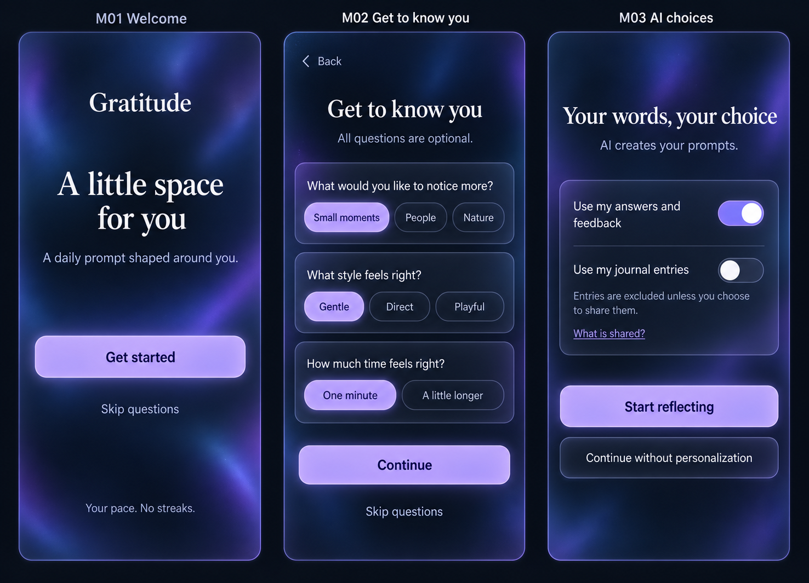
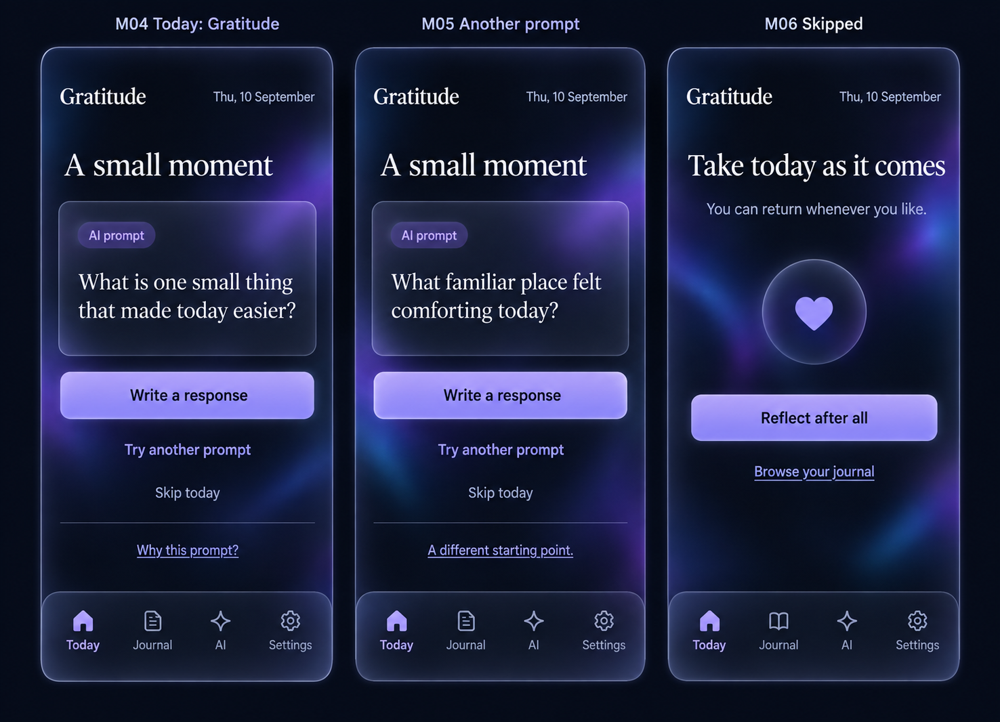
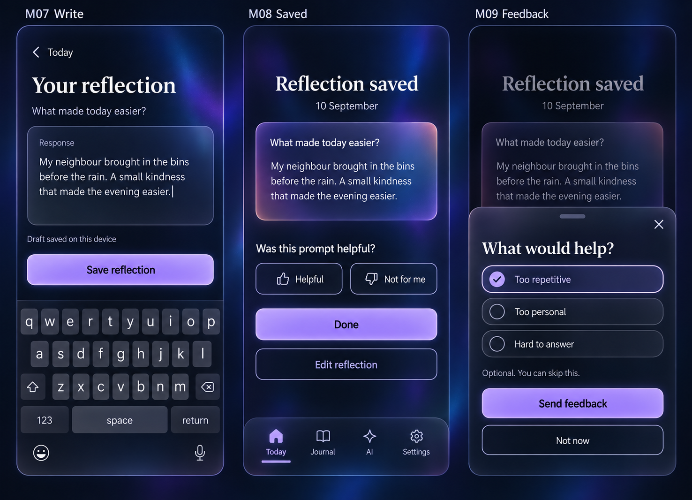
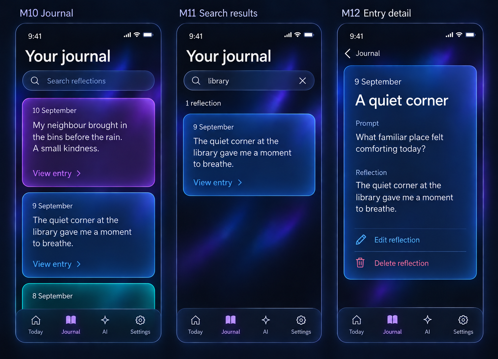
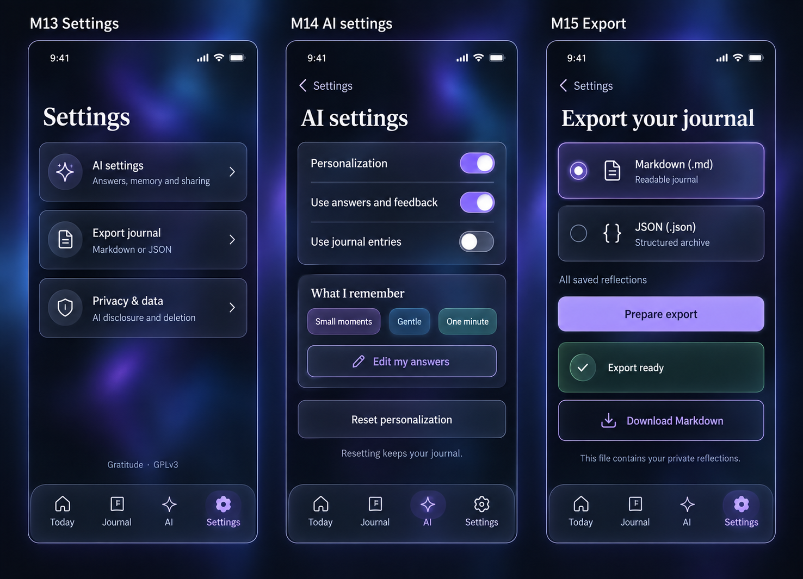
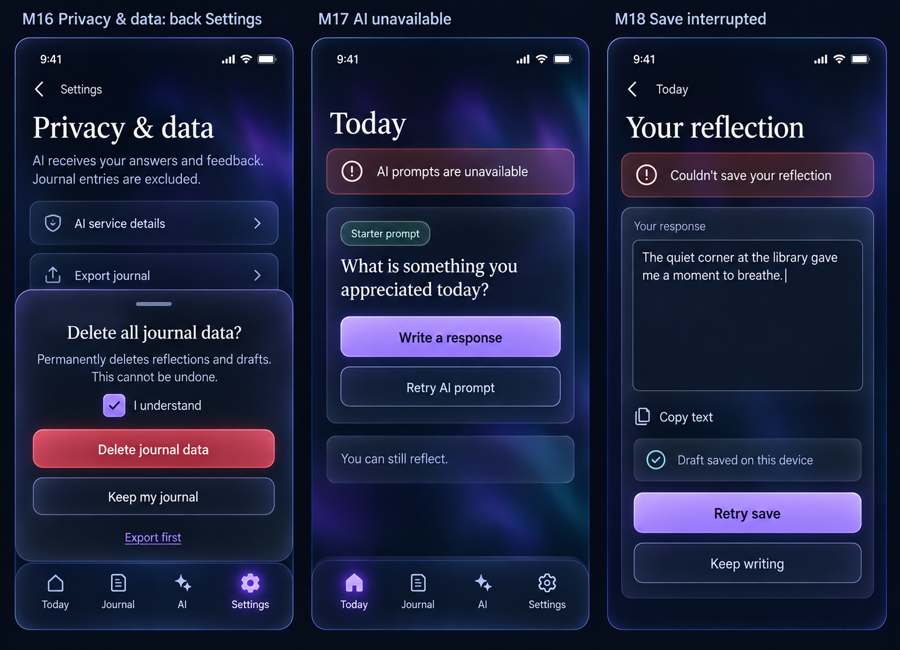
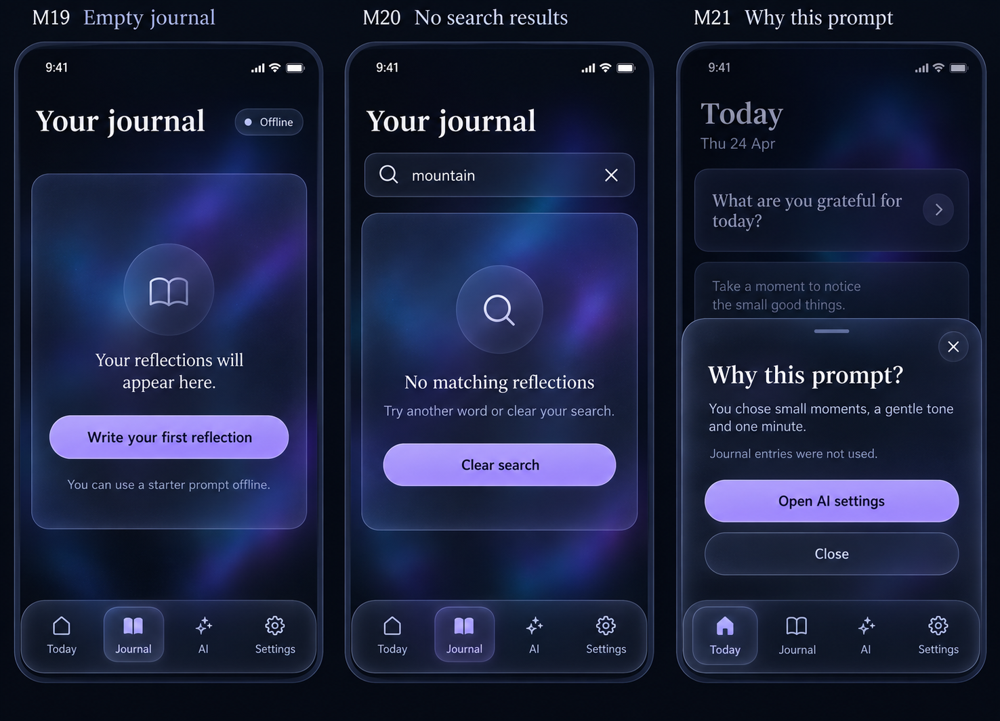

# Gratitude mobile UX design

Gratitude is a dark-mode-only mobile SPA with frosted glass surfaces and a rainbow journal. This proposal contains seven image-generated boards covering twenty-one screens. The written rules define behavior; the raster mockups illustrate appearance and are not a working application.

## Navigation and daily flow

The four persistent, labeled tabs are **Today · Journal · AI · Settings**. AI opens AI settings directly, without an intermediate Settings page. Settings also links to AI settings for discoverability. The main daily route is Today → Write → Saved. Writing hides the bottom bar to make space for the text and keyboard.

First-time users see Welcome → optional questions → AI choices → Today. Returning users arrive at Today. The same local calendar date retains its prompt and draft across refreshes. Requesting a replacement is explicit. A reflection retains the prompt and date it was started with, including across midnight. Skipping is reversible and creates no journal entry. There are no streaks or missed-day penalties.

## Core stories

| Story | Screens | Outcome |
| --- | --- | --- |
| Let the AI get to know me | M01–M03 | Answer optional questions and choose what informs prompts. |
| Receive, replace, or skip a daily prompt | M04–M06 | Reflect at my own pace. |
| Write, preserve, save, edit, and give feedback | M07–M09, M18 | Save a reflection with clear draft and completion states. |
| Browse a colourful journal and read an entry | M10, M12 | Scan large uniform cards and open the full text. |
| Search my reflections | M11, M20 | Find matches in full saved text and recover from no results. |
| Reach settings and control AI directly | M13–M14, M21 | Inspect answers, memory, and sharing from top-level navigation. |
| Export Markdown or JSON and delete journal data | M15–M16 | Take a readable or structured copy and manage stored entries. |
| Reflect through failures or an empty journal | M17–M19 | Use a starter prompt and recover writing without false success. |

## 1. Onboarding

- **M01 Welcome:** Get started opens M02; Skip questions opens M03. No account form is proposed here. Authentication and cross-device synchronization depend on the deployment decision.
- **M02 Get to know you:** ask three optional questions: “What would you like to notice more?” (Small moments, People, Nature; multi-select), “What style feels right?” (Gentle, Direct, Playful; single-select), and “How much time feels right?” (One minute, A little longer; single-select). The mockup depicts answers already selected. Initially nothing is selected; Continue works with any or no answers. Skip questions discards the unconfirmed selections. Back retains them within the onboarding session.
- **M03 AI choices:** Use my answers and feedback is enabled in the illustrated state; Use my journal entries is off. Start reflecting confirms the displayed choices. Continue without personalization disables both sources and still allows general AI prompts. Answers stay local until this choice is confirmed. The app does not infer answers to skipped questions or require demographic or sensitive information. Answers can be reviewed, changed, or cleared later in M14.

“What is shared?” opens the AI disclosure described under M16. Enabling entry sharing requires that disclosure and explicit confirmation before any entry text is sent. A user who skips questions still has a complete daily reflection experience.

## 2. Today and choice

- **M04 Today:** Write a response opens M07. Try another prompt opens M05. Skip today opens M06. Why this prompt? opens M21. After a reflection is saved, Today offers View reflection and Edit reflection for that day.
- **M05 Another prompt:** keep the date; never silently rewrite an existing reflection. If a draft exists, confirm with Keep current prompt or Replace prompt and discard draft. Failed replacement keeps the original prompt available and offers retry or a starter prompt.
- **M06 Skipped:** Reflect after all restores today's prompt or draft. Browse your journal opens M10. The next local date returns to the ordinary Today state.

Generation shows a labeled loading state, preserves any existing prompt, and prevents duplicate requests. A failure never erases writing.

## 3. Writing, saving, and feedback

- **M07 Write:** a labeled textarea and Save reflection remain accessible above the keyboard. Disable saving for whitespace-only text. Persist the draft as the user writes, and show “Draft saved on this device” only after a successful local write. Back preserves the draft. If local persistence fails, say “Draft not saved on this device,” offer Copy text, and warn before discarding unsaved text.
- **M08 Saved:** show only after successful durable saving to the selected journal store. Done returns to Today. Edit reflection returns to M07 and updates the existing entry rather than duplicating it. Helpful records feedback and acknowledges success; Not for me opens M09. With personalization off, feedback is not silently retained for later personalization; offer an explicit way to enable it first.
- **M09 Feedback:** reasons are optional and multi-select. Send feedback saves and closes; Close and Not now dismiss without saving. Failure preserves the selection and offers Retry or Not now. Feedback affects future prompts only when its source is enabled.

## 4. Rainbow journal and search

### Card layout and colour

**M10 Journal** lists entries newest first. At the standard 390-pixel viewport and default text size, every collapsed card is **256 CSS pixels high** with 20-pixel internal padding and 16-pixel gaps. Cards prioritize the date and response, with a consistent View entry footer. Omit the original prompt from the collapsed preview so a short response can fit in full. Longer responses use a five-line preview with an ellipsis; the full entry is always available. Short responses do not shrink the card. The visible beginning of the next card signals scrolling.

Opening View entry goes to **M12**, a full, independently scrolling entry view showing date, original prompt, complete response, Edit reflection, and Delete reflection. Back restores the journal's scroll position and search query. The “A quiet corner” title in the mockup is illustrative editorial copy. The implemented entry heading uses its date; no AI-generated or required entry title is introduced.

Each saved entry receives a stable colour from a repeating sequence: **red → orange → yellow → green → cyan → blue → violet**. Store its palette index when first saved. Newest-first browsing shows the sequence in reverse, producing a rainbow as the user scrolls. The example board shows violet, blue, then cyan. Colours stay attached through edits, search, and deletion of other entries; do not recolour the list on filtering. The palette repeats after seven entries and does not encode emotion, quality, or category. Deletion may leave gaps in the sequence.

Use a distinct tinted glass fill, luminous edge, and faint glow for each card. Keep ivory text readable against every tint; yellow and orange use dark amber surfaces, not bright fills. Detail and search results reuse the same entry colour. At narrow widths or enlarged text sizes, increase the shared collapsed-card height consistently across the list to preserve controls and readable text. The 256-pixel default is not a cap on accessibility reflow.

### Search behavior

**M11 Search** is reachable through the labeled Search reflections field at the top of Journal. Search all saved prompt and response text, not just card previews, with case-insensitive, accent-insensitive matching. Trim whitespace, split the query into words, and require every word to match somewhere in an entry. Blank input restores the full journal. Keep results newest first and retain the same card size and colour. Show a result count, a clear control, and highlights that do not rely on colour alone. If a match is outside the preview, show “Match in full entry”; opening the result reveals and highlights the matching text.

Search is ordinary text search, without sending queries or journal content to an AI service or keeping a search history. Hide the keyboard when opening a result and restore query and scroll on Back. Announce result counts after input settles without moving focus. Offline search uses available local entries and labels results “Searching entries on this device” if the journal is incomplete. Never present an incomplete cache as an authoritative search of the entire journal.

**M20** shows no matches and Clear search; it is distinct from **M19**, which represents no saved entries. A search failure preserves the query and offers Retry. Do not replace a failure with “No matching reflections.”

Delete reflection in M12 uses the M16 confirmation pattern with the single entry's date and “Delete this reflection?” wording. Cancel retains it; success returns to the same journal context. Failure keeps the entry and offers retry.

## 5. Settings, AI, and export

- **M13 Settings** is a visible destination with rows for AI settings, Export journal, and Privacy & data. AI settings opens M14 and selects the AI tab. Export and Privacy & data retain the Settings tab and a labeled Back control. There is no theme selector: every screen is dark.
- **M14 AI settings** is also one tap away through the persistent AI tab. The illustrated Back to Settings control appears only when opened from Settings; direct tab entry has no parent Back control. Personalization off stops use of all personalization sources and disables their controls. Stored answers remain inspectable until cleared. Edit my answers reuses M02 with current selections and Save changes / Cancel, plus Clear answers. “What I remember” shows explicit answers and remembered feedback, not inferred sensitive traits. Individual remembered feedback items can be removed.
- **Reset personalization** asks “Reset personalization? This clears your answers and remembered feedback. Your journal stays.” Reset personalization confirms; Cancel leaves it untouched. Success clears answers and memory, turns personalization and both sources off, and leaves the journal intact. Re-enabling requires choosing sources again.

### Export formats

**M15 Export** provides a radio choice of **Markdown (.md)** or **JSON (.json)**, followed by Prepare export. Markdown is the initial selection. Both export all saved reflections, regardless of the current search, with dates, prompts, complete responses, stable entry IDs and palette indices, and a separate personalization section containing explicit answers and saved feedback. Unsaved drafts are excluded; the screen says “All saved reflections.”

Markdown produces one UTF-8 `gratitude-YYYY-MM-DD.md` file, with a heading per dated reflection, separate Prompt and Reflection sections, and an appendix for personalization. Preserve paragraph breaks and escape user-authored Markdown syntax as literal content so embedded text cannot become unintended headings or links. JSON produces `gratitude-YYYY-MM-DD.json` with a schema version, export timestamp, entries array, and personalization object. Neither format depends on the visual card preview or includes service credentials. These are export formats; import is not implied.

Prepare export shows Preparing export, then Export ready with **Download Markdown** or **Download JSON**, matching the selected format. The board depicts a prepared Markdown export; Prepare export then acts as regeneration. Changing format clears the ready file and requires preparation again. Errors preserve the format choice and offer Retry. Downloads contain private reflections, stated beside the action. If only a partial journal is available offline, explain that and wait for the full journal before preparing an export labeled “All saved reflections.”

## 6. Privacy and recovery

- **M16 Privacy & data:** show the active AI sources accurately. The illustrated state uses answers and feedback and excludes entries. AI service details must identify the selected service, exactly which fields are sent, how any allowed entries are selected, and the service's retention behavior before entry sharing is confirmed. No service has been selected yet. Turning sharing off excludes entries from future requests and clears entry-derived context held by the app; it does not claim to retract previous requests.
- **Delete journal data** opens the depicted glass sheet. Its acknowledgment starts unchecked; the board shows the checked, actionable state. Keep my journal cancels. Export first opens M15. Success clears reflections, drafts, and entry-derived context, then opens M19; explicit answers remain. Disable duplicate submission while deleting. On failure accurately report what has not been deleted, preserve the dialog, and offer retry; do not claim completion until the applicable storage locations confirm it.
- **M17 AI unavailable:** offer a bundled Starter prompt that is distinct from an AI prompt. Write a response remains usable. Retry AI prompt is available when connected and does not block reflection.
- **M18 Save interrupted:** preserve editor text and the device draft; retry must not create duplicates. Keep writing focuses the textarea; Copy text is a fallback, with selectable text if clipboard access fails. A device draft is not a synchronization guarantee. For a local-only journal, successful durable local saving may show M08 while offline; this failure state covers a failed journal commit.

## 7. Empty states and prompt explanation

- **M19 Empty journal:** Write your first reflection opens Today with a starter prompt while offline. Cached entries remain readable. An unavailable cache says “Your journal isn't available offline,” not “Your reflections will appear here.” Offline operation requires the app to have loaded and cached its assets at least once.
- **M20 No matches:** Clear search returns the full available journal, preserving card colours and sizes. The user can also edit the search field directly.
- **M21 Why this prompt?:** display the actual source choices attached to the generated prompt, such as “You chose small moments, a gentle tone and one minute.” With personalization off, say “A general gratitude prompt.” Entry-use text reflects the actual request. Open AI settings goes directly to M14. Do not invent model reasoning.

## Dark glass visual system and accessibility

Use a midnight navy canvas (`#080C16`), restrained diffuse violet and blue ambient glows, translucent smoked-glass panels, fine light borders, and a subtle backdrop blur. Typography is ivory (`#F4F5FA`) with secondary text (`#B9C2D4`); primary actions use a luminous lavender surface and dark text. Dialogs, sheets, input surfaces, and keyboard styling remain dark. Rainbow colouring is reserved for journal entries; it does not compete with navigation or statuses.

Design at 390 × 844 CSS pixels, reflowing to 320 pixels without horizontal scrolling. Use 20-pixel page gutters, an 8-pixel spacing rhythm, 16-pixel body text, and targets at least 44 × 44 pixels. Respect safe areas and the visual viewport when the keyboard opens. Larger screens retain a centered readable column. Text stays on a sufficiently opaque surface rather than directly over changing glows. Without blur support or with reduced-transparency preferences, use opaque dark surfaces while retaining borders and entry hues.

Use one consistent icon per tab in implementation: house, book, sparkle, gear. Selected tabs expose text and shape cues, not colour alone. Measure contrast across all seven card tints and focus states; image generation is not contrast validation. Support 200% text zoom with card reflow. No floating background animation is needed; respect reduced motion.

Use labeled native controls, visible focus, a current-page state on navigation, and polite live announcements for saves, failures, and search counts. Dialogs and sheets trap focus, support Escape and a visible dismiss action, and return focus to the opener. Expanded entry text scrolls without shrinking fonts. Dark mode does not remove the need to support keyboard and screen-reader navigation.

## Provenance and review

These boards use fictional reflections and the built-in image generation tool. Final assets are in [docs/ux/mockups](docs/ux/mockups); exact generation and edit prompts are in [docs/ux/prompts](docs/ux/prompts). The M01–M21 boards supersede the original S01–S15 light-mode proposal. User requests remain verbatim in [PROMPTS.md](PROMPTS.md), with decisions and discoveries in [LEARNINGS.md](LEARNINGS.md).

The design is for review. Storage, AI service selection, browser accessibility, and actual export behavior remain implementation work. The journal layout correction improves uniformity, but generated card heights still vary slightly and the final search-result image omits the match highlight. The written fixed-height and highlighting rules are required in implementation. Other generated icon and spacing differences are illustrative.
