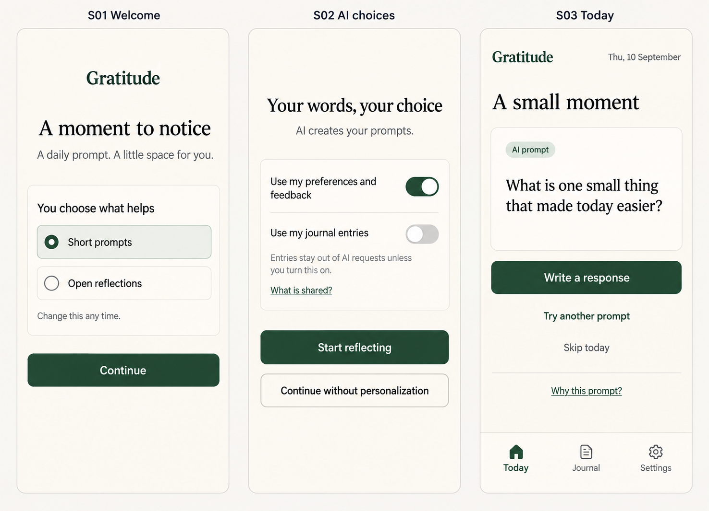
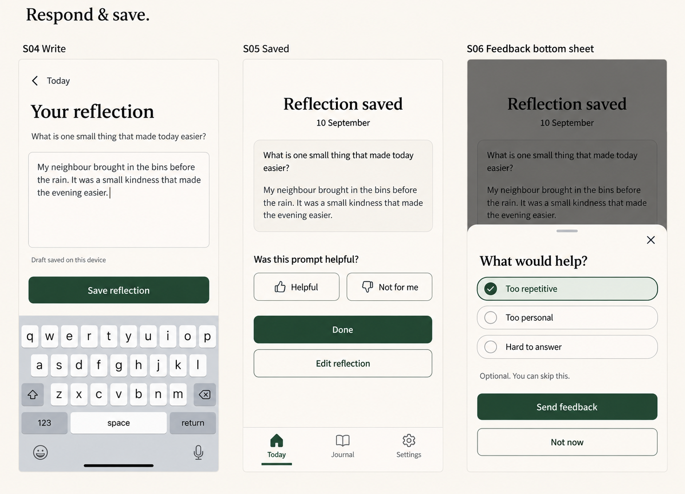
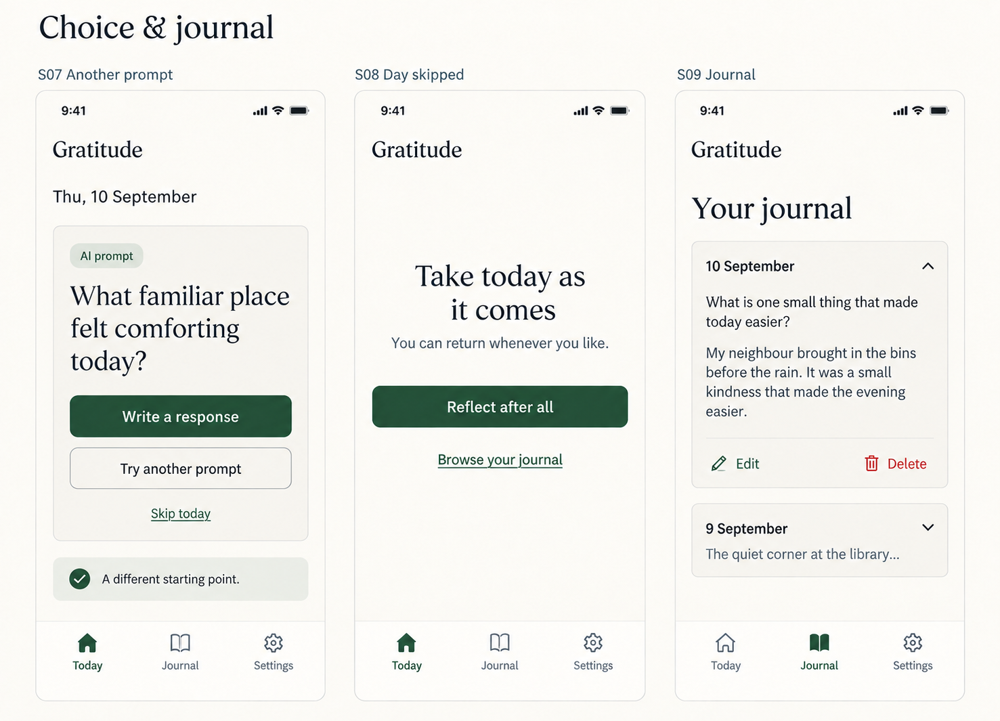
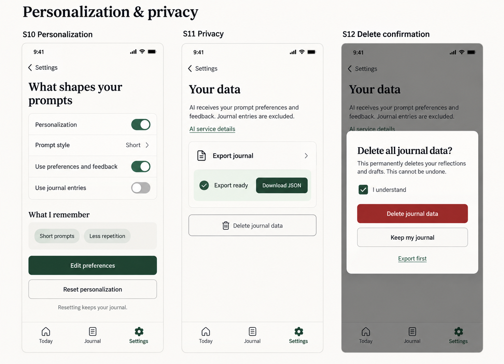
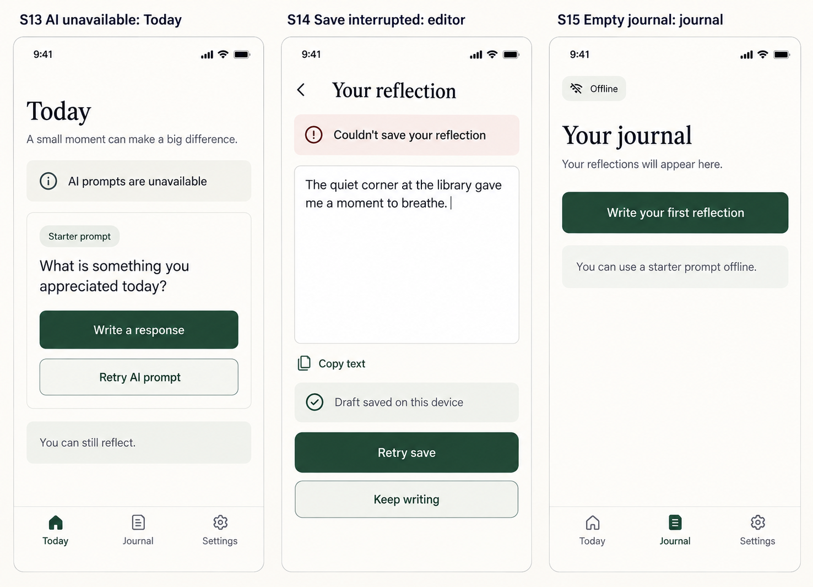

# Gratitude mobile UX design

This design proposes the mobile experience described in [VISION.md](VISION.md). The five generated boards below cover fifteen screens. They are review mockups, not a working application. Interaction rules and exact behavior are specified here; generated typography and control geometry are illustrative.

## Daily experience

The main route is **Today → Write → Saved**. A persistent, labeled navigation bar connects Today, Journal, and Settings. Writing hides that bar to preserve room for the draft and keyboard. Returning users arrive at Today; first-time users choose their prompt style and AI context before reaching it.

One daily prompt is associated with the user's local calendar date. Refreshing preserves that prompt and any draft. Asking for another is explicit. A reflection keeps the prompt and date it was started with, including across midnight. Skipping is reversible and creates no journal entry. There are no streaks, scores, or missed-day penalties.

## Core stories and mockups

| Story | Screens | User outcome |
| --- | --- | --- |
| Start with a prompt style and understand AI use | S01–S02 | Begin with short or open prompts and choose what informs them. |
| Receive a daily gratitude prompt | S03 | Read a prompt and start a response. |
| Write, preserve, save, and edit a reflection | S04–S05, S14 | Keep writing safely, then receive an explicit save confirmation. |
| Tell the app what prompting works | S05–S06 | Give optional feedback without interrupting reflection. |
| Request another prompt or skip | S07–S08 | Choose another starting point or leave without penalty. |
| Revisit and manage past reflections | S09, S15 | Read dated entries, edit or delete one, or start an empty journal. |
| Inspect, change, disable, or reset personalization | S10 | Control preferences and remembered feedback independently of the journal. |
| Understand AI sharing, export, or delete data | S02, S11–S12 | See what is shared and control the journal's lifecycle. |
| Reflect when generation or saving fails | S13–S15 | Use a starter prompt and recover a draft without a false success state. |

### 1. Start and daily prompt

- **S01:** prompt style is a single choice, editable later. Continue opens S02. No account form is part of this proposal; authentication and synchronization need a separate deployment decision.
- **S02:** preferences and feedback may inform prompts; journal entry sharing is off. Start reflecting applies the choices. Continue without personalization disables both sources and still supplies general AI prompts. “What is shared?” opens the disclosure described under S11. Turning journal sharing on requires a disclosure and explicit confirmation before any entry content is sent.
- **S03:** Write a response opens S04. Try another opens S07, and Skip today opens S08. “Why this prompt?” shows the actual contributing preferences, such as “You chose short prompts,” and links to S10. With personalization off, it says “A general gratitude prompt.” It must not invent an explanation of model reasoning.

### 2. Write, save, and feedback

- **S04:** the textarea has a persistent label. Save reflection stays above the on-screen keyboard and is disabled for whitespace-only content. Draft persistence starts as the user writes; “Draft saved on this device” appears only after a successful local write. Back and navigation preserve the draft. If local persistence fails, show “Draft not saved on this device,” offer Copy text, and warn before discarding.
- **S05:** appear only after successful durable saving to the chosen journal store. Done returns to Today showing today's saved entry; Edit reflection reopens S04 with its existing text and updates that entry rather than creating a duplicate. Helpful records feedback and acknowledges “Feedback saved.” Not for me opens S06. When personalization is off, do not retain feedback for personalization; offer an explicit way to enable it first.
- **S06:** reasons are optional and multi-select. Send feedback saves the selection and closes the sheet; Not now or Close dismisses without saving. Feedback affects future prompts only when enabled. A failed submission leaves the selection visible with Retry and Not now.

### 3. Choice and journal

- **S07:** replacement keeps the date and does not silently rewrite an existing reflection. If a draft exists, offer Keep current prompt or Replace prompt and discard draft with clear confirmation. A generation failure keeps the original prompt usable and offers retry or S13's starter prompt.
- **S08:** Reflect after all restores today's prompt or draft. Browse your journal opens S09. The next local calendar day returns to the normal Today state.
- **S09:** entries appear newest first with an excerpt and date. Tapping a card expands its full prompt and response; collapse is available through the same accessible disclosure control. Edit opens S04. Delete opens a confirmation using the S12 pattern, but names the single entry and says “Delete this reflection?” Cancel keeps it. Successful deletion removes it from the list; failure keeps it visible with retry.

### 4. Personalization and data controls

Settings provides two destinations: Personalization (S10) and Your data (S11). Each settings subpage has a labeled Back control. The boards focus on these destinations rather than adding an intermediate settings screen.

- **S10:** the master switch stops use of personalization context and disables its source controls. Stored settings remain visible until reset. Edit preferences reuses the S01 style choices and allows removing remembered feedback. “What I remember” contains concrete user choices and feedback summaries, not inferred sensitive traits. Reset opens a confirmation: “Reset personalization? This clears your preferences and remembered feedback. Your journal stays.” Actions are Reset personalization and Cancel. After reset, personalization is off, its source switches are off, and the memory list is empty. Re-enabling requires choosing sources again.
- **S11:** disclosure must identify the selected AI service, exactly which fields are sent, how any permitted entries are selected, and the service's retention behavior before entry sharing is confirmed. No provider has been selected, so “AI service details” is a destination in this design, not a completed disclosure. Sharing off excludes entries from new requests; it must not claim to retract past requests. Turning sharing off clears any entry-derived personalization context held by the app.
- **Export:** Export journal initiates a versioned JSON download containing dates, prompt text, responses, and personalization settings. Show Preparing export, then Export ready with Download JSON; errors offer Retry. Keep the ready state until download is initiated. Provide a plain-language reminder that the downloaded file contains private reflections.
- **S12:** deleting journal data requires a distinct confirmation and an initially unchecked acknowledgment. The board depicts the checked, actionable state. Export first returns to S11. Keep my journal cancels. Success clears reflections, drafts, and entry-derived context, then opens S15; explicit preferences remain. During deletion disable duplicate submission. On failure keep the dialog open with the data intact wherever deletion has not succeeded, report the failure accurately, and offer retry. Do not claim completion until the applicable storage locations confirm it.

### 5. Recovery and empty states

- **S13:** a bundled starter prompt remains available without AI. Label it Starter prompt, preserving the distinction from generated prompts. Retry AI prompt is available when connected. Reflection never depends on retry succeeding.
- **S14:** a save failure retains the current editor text and locally persisted draft. Retry save is safe to repeat without creating duplicate entries. Keep writing returns focus to the textarea; Copy text offers a fallback, with selectable text if clipboard access fails. Do not promise that a device draft is synchronized. If the app uses a local-only journal, this same state covers a failed local journal commit; successful durable local saving may show S05 while offline.
- **S15:** Write your first reflection opens Today with a starter prompt while offline. Existing cached entries remain readable offline; an uncached journal shows “Your journal isn't available offline,” not the empty-journal message. Offline support applies after the application has loaded and cached its required assets at least once.

Prompt generation shows a labeled loading state, retains any existing prompt, and prevents duplicate requests. Every asynchronous operation has a retry path; no spinner replaces the user's draft. Long reflections scroll naturally rather than shrinking text to fit.

## Mobile layout and accessibility

Design around a 390 × 844 CSS-pixel viewport, then reflow down to 320 pixels without horizontal scrolling. Use a single column with 20-pixel side gutters, an 8-pixel spacing rhythm, 16-pixel body text, and controls at least 44 × 44 pixels. Respect browser safe areas and the visual viewport when the keyboard opens. Larger screens retain a readable, centered content column rather than stretching the journal across the page.

Use an off-white surface, near-black text, and a dark green primary action. Selected states include text or shape cues. Destructive actions have explicit wording as well as color. The generated colors and geometry are visual direction; implementation must measure text contrast, support 200% text zoom, and preserve focus visibility.

Use native text inputs, buttons, and labeled switches. Navigation exposes the current page. Announce save/error status through a polite live region without moving focus. Dialogs and sheets trap focus, support Escape, and restore focus to their opener. On touch screens, dismissal must remain possible through a visible button. Respect reduced motion and never depend on animation to explain a state.

## Review boundaries and provenance

The boards use fictional journal text and were created with the built-in image generation tool. Exact generation prompts are stored in [docs/ux/prompts](docs/ux/prompts); user instructions remain in [PROMPTS.md](PROMPTS.md). The PNG files are committed under [docs/ux/mockups](docs/ux/mockups).

This PR is a design proposal. It does not implement data protection, offline storage, accessibility, or AI personalization. Review the daily flow, default AI context choices, entry management, and failure recovery before selecting the storage and AI architecture. The finished-product vision remains in VISION.md.
