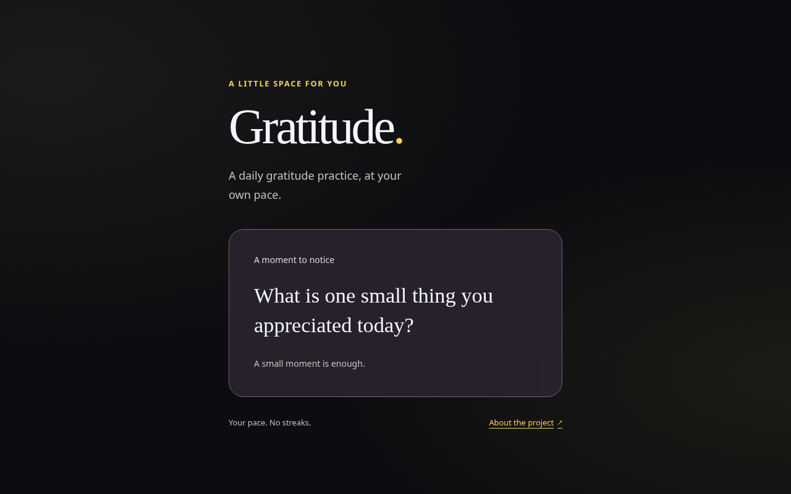

<!-- Generated by the E2E test. Do not edit by hand. -->

# The Gratitude landing page

A visitor opens the production build and sees the Gratitude introduction.

Viewport: desktop-chromium.

## A visitor can open Gratitude

**Verifications:**

- [x] The landing document returns HTTP 200
- [x] The page identifies itself as Gratitude
- [x] The main heading is visible
- [x] Screenshot matches the committed baseline (zero differing pixels)
