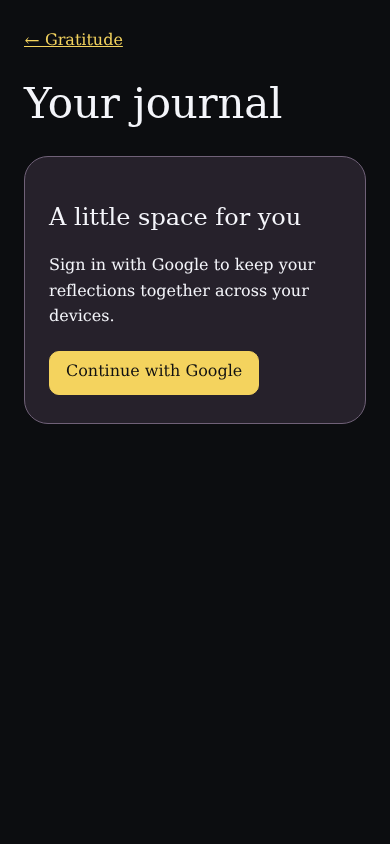
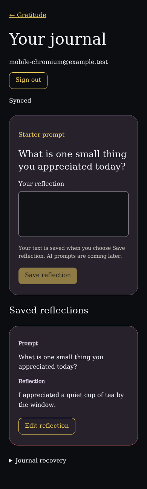

<!-- Generated by the E2E test. Do not edit by hand. -->

# Firebase journal foundation

Google authentication protects a private event stream. A second device, reload, and full projection rebuild recover the same reflection; signing out clears the visible journal. Uses local emulators and fictional data.

Viewport: mobile-chromium.

## A visitor signs in to their private journal

**Verifications:**

- [x] Google sign-in is offered before journal data is shown
- [x] No reflection editor is shown before authentication
- [x] Screenshot matches the committed baseline (zero differing pixels)

## A reflection is saved to the signed-in account

**Verifications:**

- [x] The saved entry contains the prompt and exact user text
- [x] Cloud synchronization is confirmed
- [x] Screenshot matches the committed baseline (zero differing pixels)

## The same journal survives reload and complete projection rebuild

**Verifications:**

- [x] The saved reflection is reconstructed without duplication
- [x] The editor remains empty after recovery
- [x] Screenshot matches the committed baseline (zero differing pixels)
