<!-- Generated by the E2E test. Do not edit by hand. -->

# Private journal, synchronization and recovery

Every navigation, click and text-entry action has a screenshot, including the Google emulator popup and second device. Fixed browser and emulator clocks keep all rendered dates visible and exactly comparable.

Viewport: mobile-chromium.

## Open Gratitude

**Verifications:**

- [x] The expected result of this action is visible
- [x] Screenshot matches the committed baseline (zero differing pixels)

## Choose Google sign-in

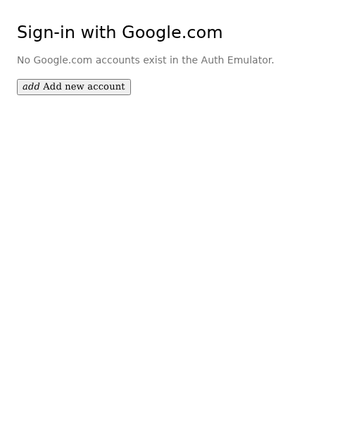

**Verifications:**

- [x] The Google emulator account chooser opens
- [x] Screenshot matches the committed baseline (zero differing pixels)

## Add a fictional Google account

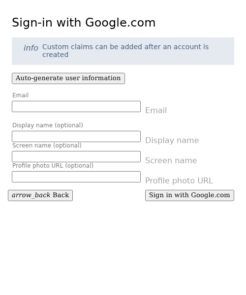

**Verifications:**

- [x] The account form opens
- [x] Screenshot matches the committed baseline (zero differing pixels)

## Enter the fictional email address

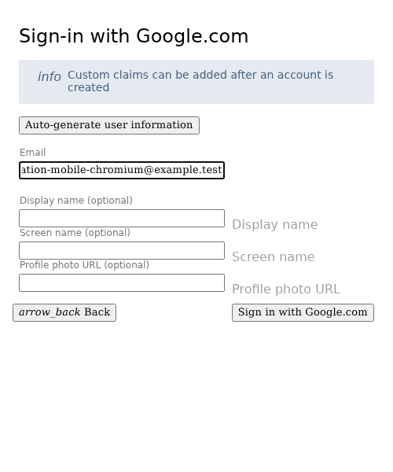

**Verifications:**

- [x] The email field retains the input
- [x] Screenshot matches the committed baseline (zero differing pixels)

## Enter a display name

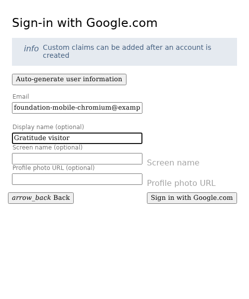

**Verifications:**

- [x] The display name is entered
- [x] Screenshot matches the committed baseline (zero differing pixels)

## Complete sign-in and open Today

**Verifications:**

- [x] The private journal is synchronized and Today is ready
- [x] Screenshot matches the committed baseline (zero differing pixels)

## Open the reflection editor

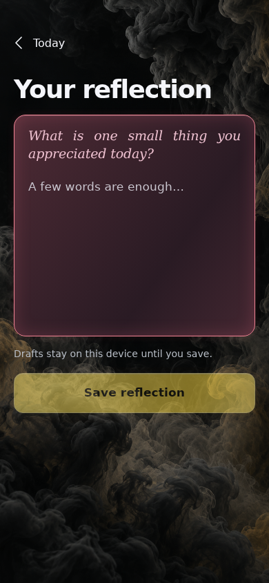

**Verifications:**

- [x] The expected result of this action is visible
- [x] Screenshot matches the committed baseline (zero differing pixels)

## Write a reflection

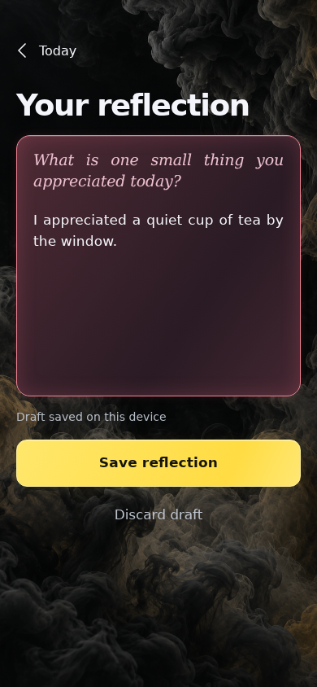

**Verifications:**

- [x] The expected result of this action is visible
- [x] Screenshot matches the committed baseline (zero differing pixels)

## Save the reflection

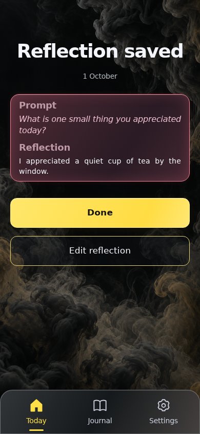

**Verifications:**

- [x] The expected result of this action is visible
- [x] Screenshot matches the committed baseline (zero differing pixels)

## Open Gratitude on another device

**Verifications:**

- [x] The expected result of this action is visible
- [x] Screenshot matches the committed baseline (zero differing pixels)

## Choose Google sign-in

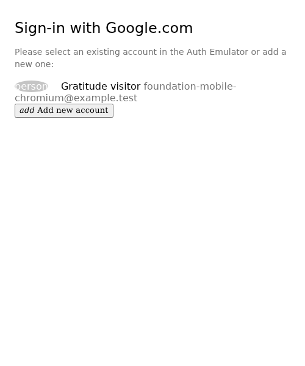

**Verifications:**

- [x] The Google emulator account chooser opens
- [x] Screenshot matches the committed baseline (zero differing pixels)

## Complete sign-in and open Today

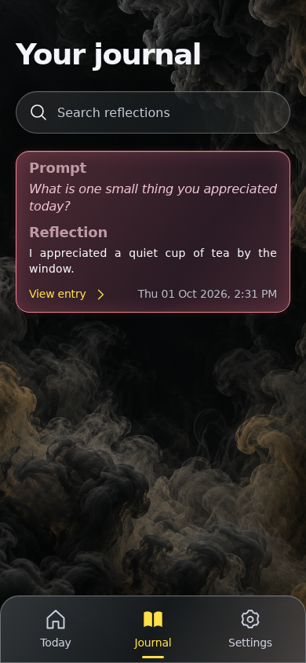

**Verifications:**

- [x] The private journal is synchronized and Today is ready
- [x] Screenshot matches the committed baseline (zero differing pixels)

## Open Journal

**Verifications:**

- [x] The expected result of this action is visible
- [x] Screenshot matches the committed baseline (zero differing pixels)

## Reload the first device

**Verifications:**

- [x] The expected result of this action is visible
- [x] Screenshot matches the committed baseline (zero differing pixels)

## Open Settings

**Verifications:**

- [x] The expected result of this action is visible
- [x] Screenshot matches the committed baseline (zero differing pixels)

## Open Privacy & data

**Verifications:**

- [x] The expected result of this action is visible
- [x] Screenshot matches the committed baseline (zero differing pixels)

## Rebuild the local projection from saved events

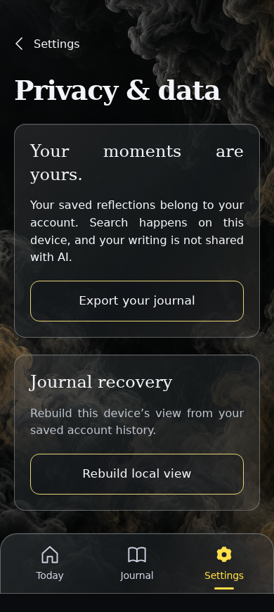

**Verifications:**

- [x] The expected result of this action is visible
- [x] Screenshot matches the committed baseline (zero differing pixels)

## Open Journal

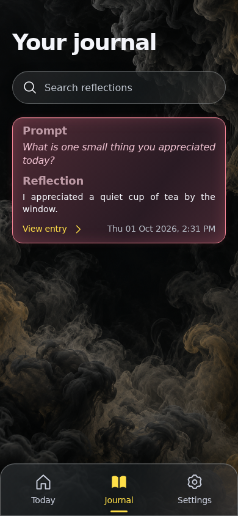

**Verifications:**

- [x] The expected result of this action is visible
- [x] Screenshot matches the committed baseline (zero differing pixels)

## Reload after a damaged device cache

**Verifications:**

- [x] The expected result of this action is visible
- [x] Screenshot matches the committed baseline (zero differing pixels)

## Verify the original reflection is recovered

**Verifications:**

- [x] The expected result of this action is visible
- [x] Screenshot matches the committed baseline (zero differing pixels)

## Open Today

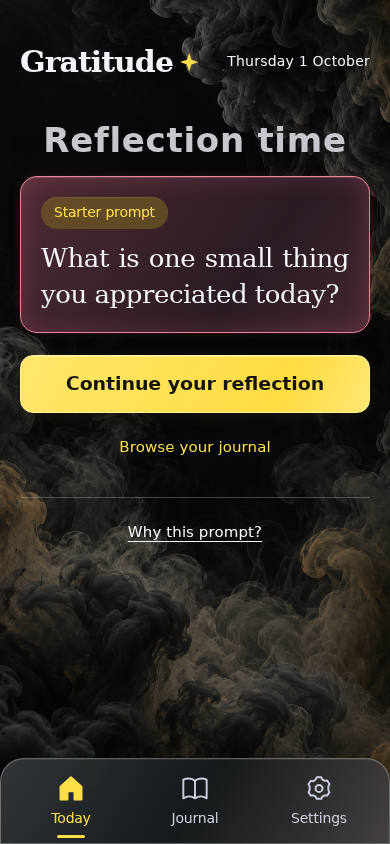

**Verifications:**

- [x] The expected result of this action is visible
- [x] Screenshot matches the committed baseline (zero differing pixels)

## Open the reflection editor

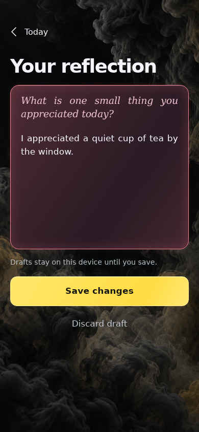

**Verifications:**

- [x] The expected result of this action is visible
- [x] Screenshot matches the committed baseline (zero differing pixels)

## Disconnect this device

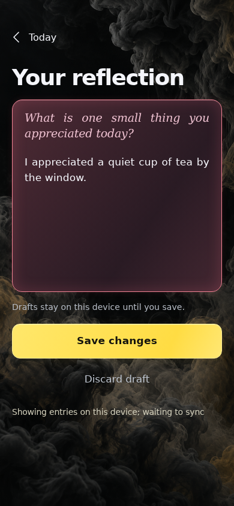

**Verifications:**

- [x] The expected result of this action is visible
- [x] Screenshot matches the committed baseline (zero differing pixels)

## Continue today’s reflection while offline

**Verifications:**

- [x] The expected result of this action is visible
- [x] Screenshot matches the committed baseline (zero differing pixels)

## Save the offline changes on this device

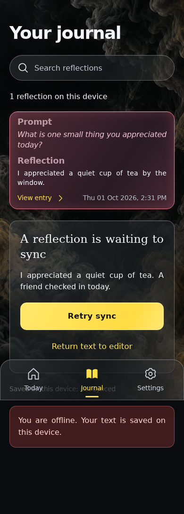

**Verifications:**

- [x] The expected result of this action is visible
- [x] Screenshot matches the committed baseline (zero differing pixels)

## Close the application before reconnecting

**Verifications:**

- [x] The expected result of this action is visible
- [x] Screenshot matches the committed baseline (zero differing pixels)

## Reconnect the device

**Verifications:**

- [x] The expected result of this action is visible
- [x] Screenshot matches the committed baseline (zero differing pixels)

## Reopen Gratitude and retry the saved outbox

**Verifications:**

- [x] The expected result of this action is visible
- [x] Screenshot matches the committed baseline (zero differing pixels)

## Check that the reflection was updated without duplication

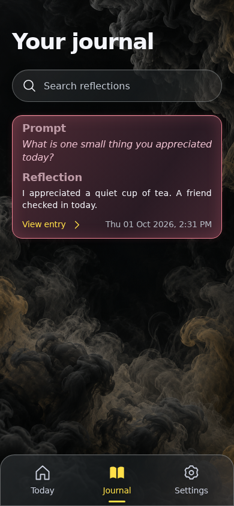

**Verifications:**

- [x] The expected result of this action is visible
- [x] Screenshot matches the committed baseline (zero differing pixels)

## Open Settings

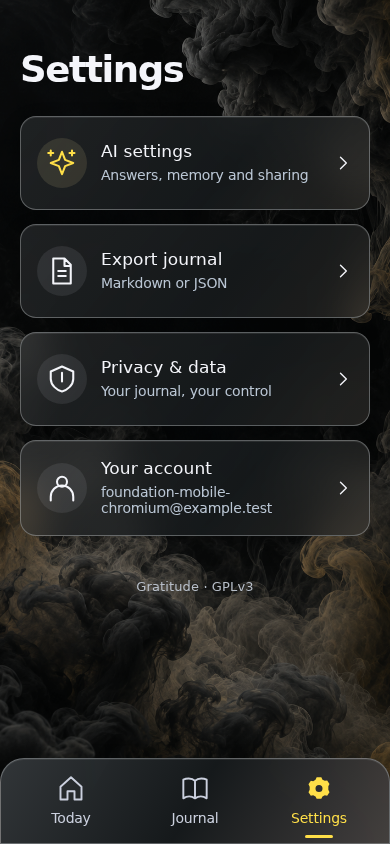

**Verifications:**

- [x] The expected result of this action is visible
- [x] Screenshot matches the committed baseline (zero differing pixels)

## Open account settings

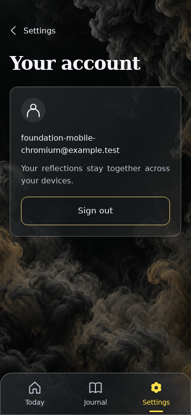

**Verifications:**

- [x] The expected result of this action is visible
- [x] Screenshot matches the committed baseline (zero differing pixels)

## Sign out and hide the private journal

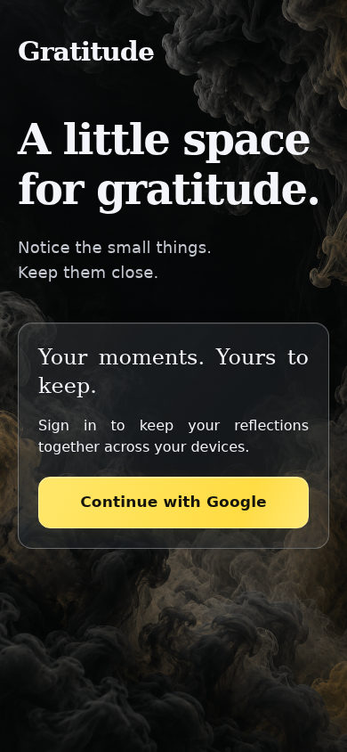

**Verifications:**

- [x] The expected result of this action is visible
- [x] Screenshot matches the committed baseline (zero differing pixels)
