<!-- Generated by the E2E test. Do not edit by hand. -->

# Browse and search your rainbow journal

Every click and text-entry action is followed by a compared screenshot. Server-generated dates are masked; card text, layout, colours and controls are compared exactly.

Viewport: desktop-chromium.

## Open Gratitude

**Verifications:**

- [x] The expected result of this action is visible
- [x] Screenshot matches the committed baseline (zero differing pixels)

## Choose Google sign-in

**Verifications:**

- [x] The Google emulator account chooser opens
- [x] Screenshot matches the committed baseline (zero differing pixels)

## Add a fictional Google account

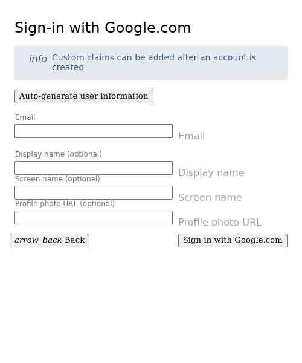

**Verifications:**

- [x] The account form opens
- [x] Screenshot matches the committed baseline (zero differing pixels)

## Enter the fictional email address

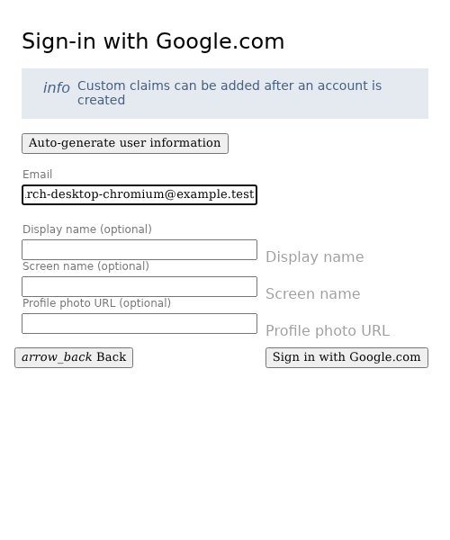

**Verifications:**

- [x] The email field retains the input
- [x] Screenshot matches the committed baseline (zero differing pixels)

## Enter a display name

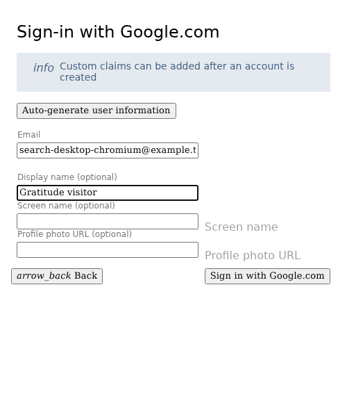

**Verifications:**

- [x] The display name is entered
- [x] Screenshot matches the committed baseline (zero differing pixels)

## Complete sign-in and open Today

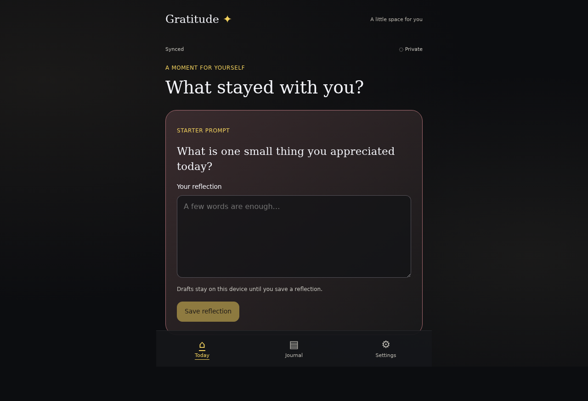

**Verifications:**

- [x] The private journal is synchronized
- [x] Screenshot matches the committed baseline (zero differing pixels)

## Write a reflection

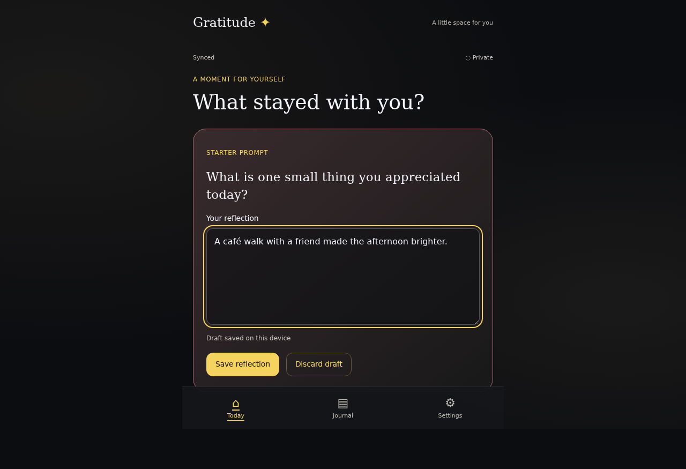

**Verifications:**

- [x] The expected result of this action is visible
- [x] Screenshot matches the committed baseline (zero differing pixels)

## Save the reflection to the journal

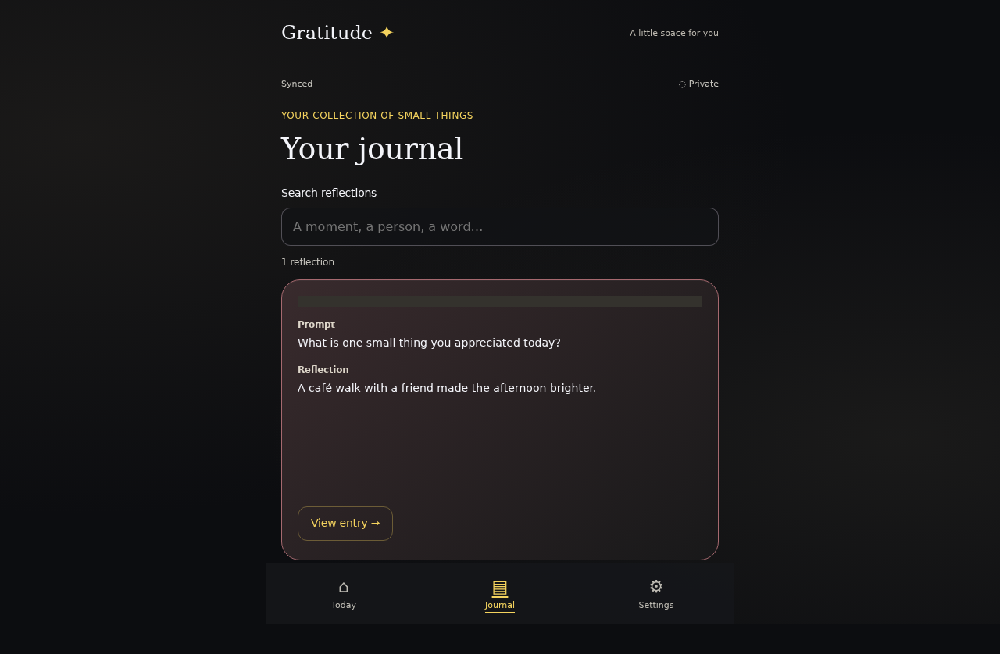

**Verifications:**

- [x] The expected result of this action is visible
- [x] Screenshot matches the committed baseline (zero differing pixels)

## Return to Today

**Verifications:**

- [x] The expected result of this action is visible
- [x] Screenshot matches the committed baseline (zero differing pixels)

## Write a reflection

**Verifications:**

- [x] The expected result of this action is visible
- [x] Screenshot matches the committed baseline (zero differing pixels)

## Save the reflection to the journal

**Verifications:**

- [x] The expected result of this action is visible
- [x] Screenshot matches the committed baseline (zero differing pixels)

## Search for an accent-insensitive phrase

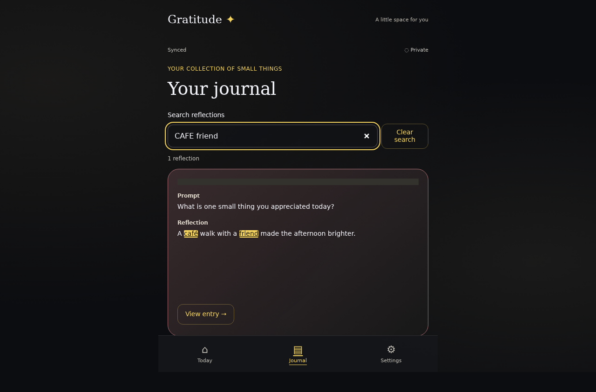

**Verifications:**

- [x] All query words match the full text and are highlighted
- [x] Screenshot matches the committed baseline (zero differing pixels)

## Open the matching reflection

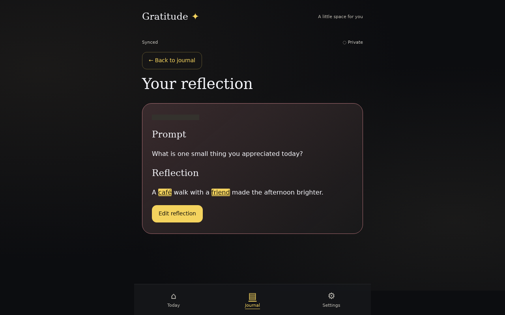

**Verifications:**

- [x] The expected result of this action is visible
- [x] Screenshot matches the committed baseline (zero differing pixels)

## Return to the retained search results

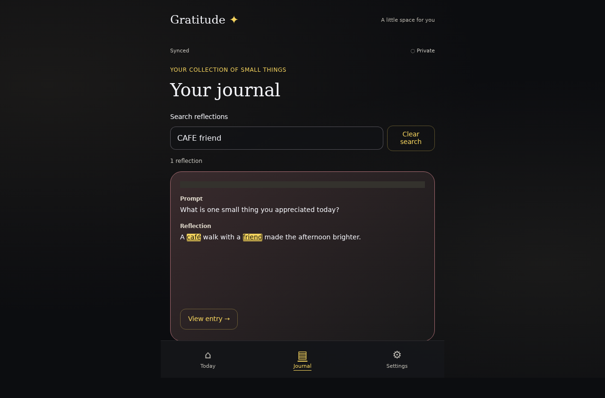

**Verifications:**

- [x] The expected result of this action is visible
- [x] Screenshot matches the committed baseline (zero differing pixels)

## Search for a missing word

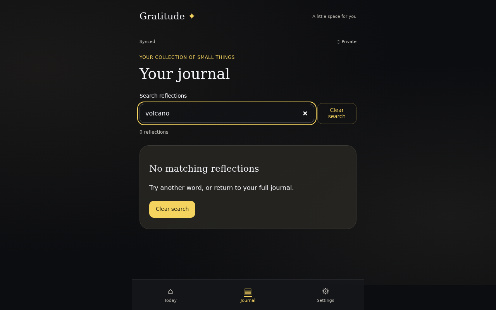

**Verifications:**

- [x] The expected result of this action is visible
- [x] Screenshot matches the committed baseline (zero differing pixels)

## Clear the search

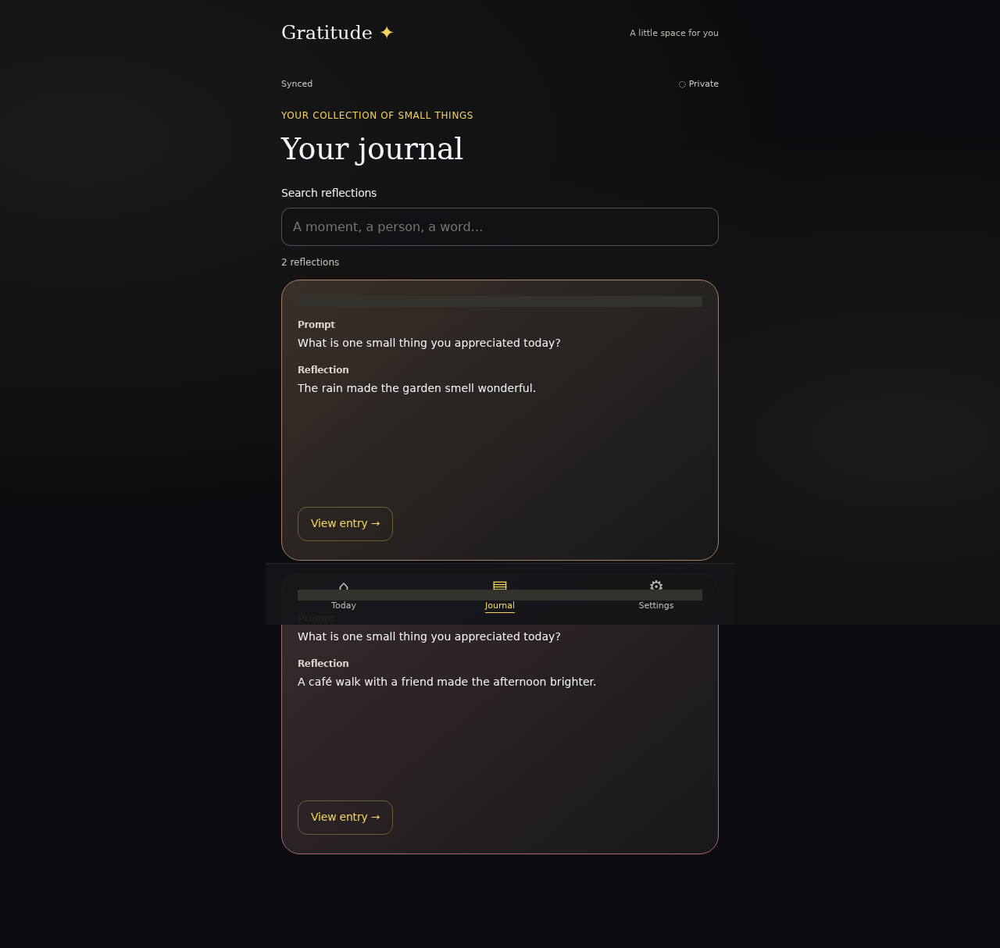

**Verifications:**

- [x] The expected result of this action is visible
- [x] Screenshot matches the committed baseline (zero differing pixels)

## Open the latest reflection

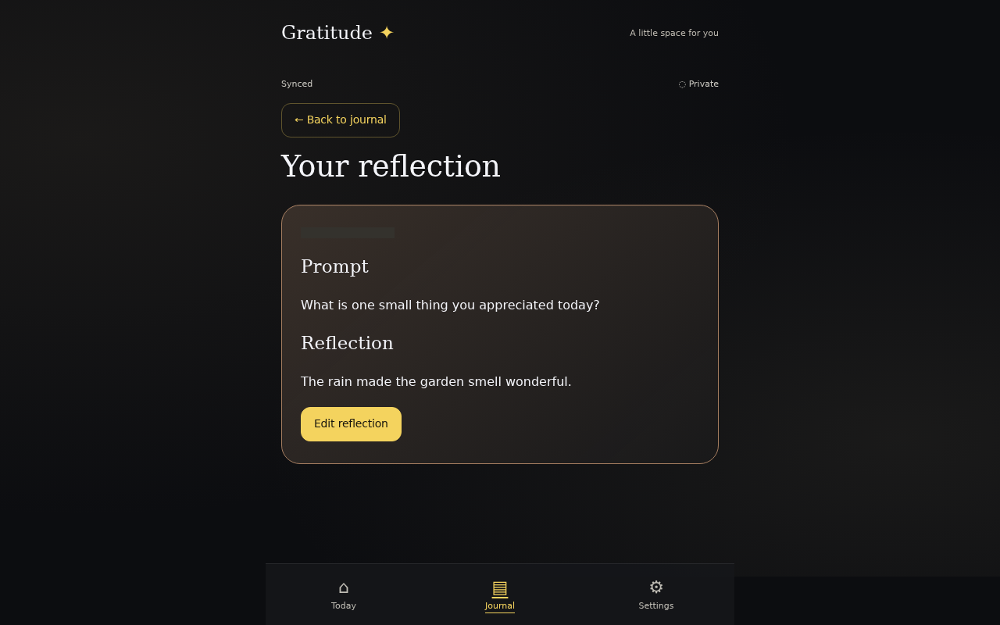

**Verifications:**

- [x] The expected result of this action is visible
- [x] Screenshot matches the committed baseline (zero differing pixels)

## Edit the saved reflection

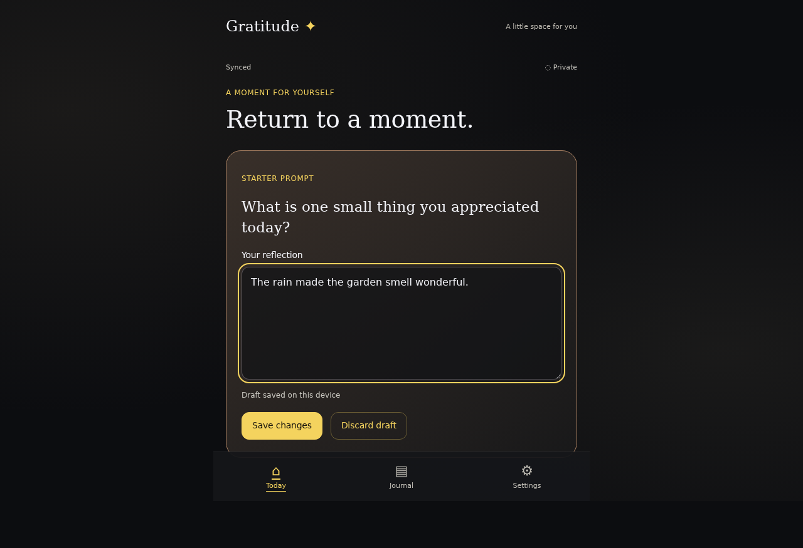

**Verifications:**

- [x] The expected result of this action is visible
- [x] Screenshot matches the committed baseline (zero differing pixels)

## Add a remembered detail

**Verifications:**

- [x] The expected result of this action is visible
- [x] Screenshot matches the committed baseline (zero differing pixels)

## Save changes without adding a duplicate entry

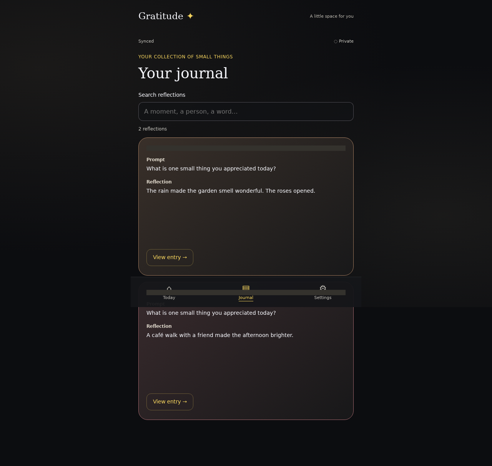

**Verifications:**

- [x] The expected result of this action is visible
- [x] Screenshot matches the committed baseline (zero differing pixels)
