<!-- Generated by the E2E test. Do not edit by hand. -->

# Browse and search your rainbow journal

Every click and text-entry action is followed by a compared screenshot. Historical raw-event fixtures exercise content-sized cards, three-line previews, expansion, local timestamps and full-entry editing.

Viewport: mobile-chromium.

## Open Gratitude

**Verifications:**

- [x] The expected result of this action is visible
- [x] Screenshot matches the committed baseline (zero differing pixels)

## Choose Google sign-in

**Verifications:**

- [x] The Google emulator account chooser opens
- [x] Screenshot matches the committed baseline (zero differing pixels)

## Add a fictional Google account

**Verifications:**

- [x] The account form opens
- [x] Screenshot matches the committed baseline (zero differing pixels)

## Enter the fictional email address

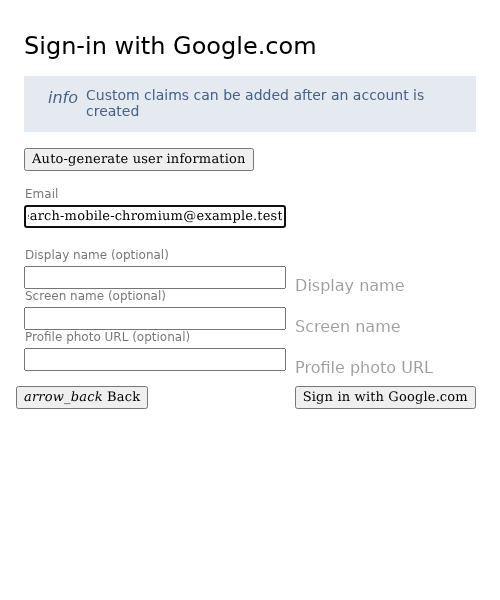

**Verifications:**

- [x] The email field retains the input
- [x] Screenshot matches the committed baseline (zero differing pixels)

## Enter a display name

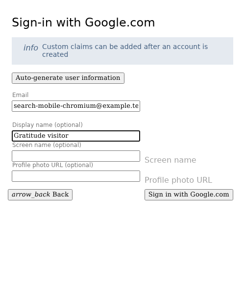

**Verifications:**

- [x] The display name is entered
- [x] Screenshot matches the committed baseline (zero differing pixels)

## Complete sign-in and open Today

**Verifications:**

- [x] The private journal is synchronized and Today is ready
- [x] Screenshot matches the committed baseline (zero differing pixels)

## Browse short and long rainbow reflections

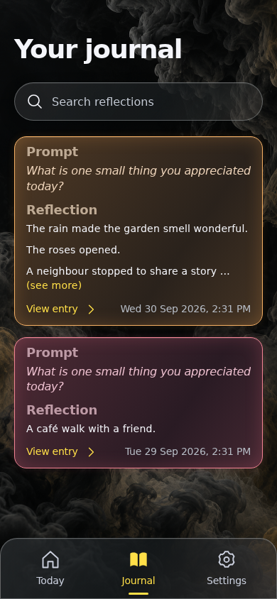

**Verifications:**

- [x] Short cards shrink, long reflections show three lines and a spaced ellipsis, and dates use local time
- [x] Screenshot matches the committed baseline (zero differing pixels)

## Expand the longer reflection in place

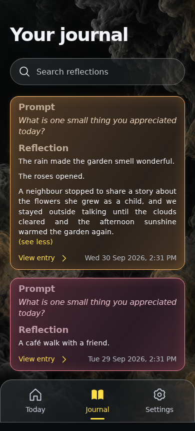

**Verifications:**

- [x] The expected result of this action is visible
- [x] Screenshot matches the committed baseline (zero differing pixels)

## Collapse the reflection again

**Verifications:**

- [x] The expected result of this action is visible
- [x] Screenshot matches the committed baseline (zero differing pixels)

## Focus the search field

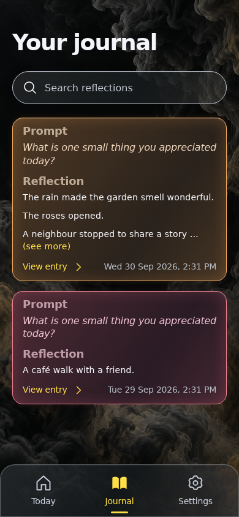

**Verifications:**

- [x] The expected result of this action is visible
- [x] Screenshot matches the committed baseline (zero differing pixels)

## Search for an accent-insensitive phrase

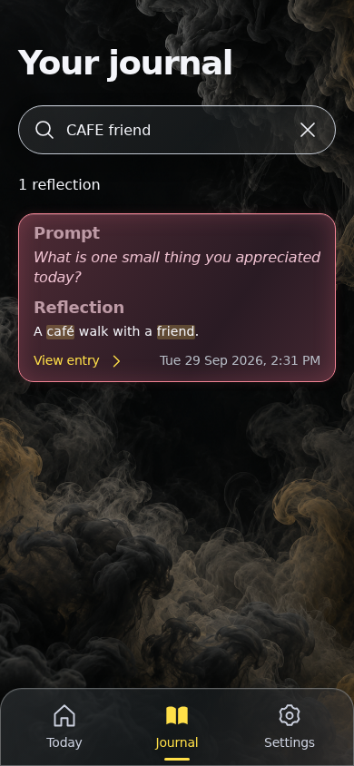

**Verifications:**

- [x] All query words match the full text and are highlighted
- [x] Screenshot matches the committed baseline (zero differing pixels)

## Open the matching reflection

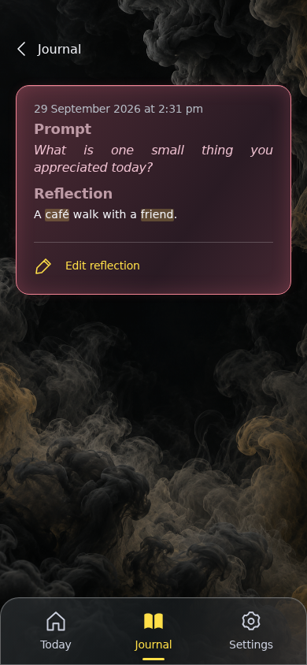

**Verifications:**

- [x] The full reflection includes its prompt and local date and time
- [x] Screenshot matches the committed baseline (zero differing pixels)

## Return to the retained search results

**Verifications:**

- [x] The expected result of this action is visible
- [x] Screenshot matches the committed baseline (zero differing pixels)

## Search for a missing word

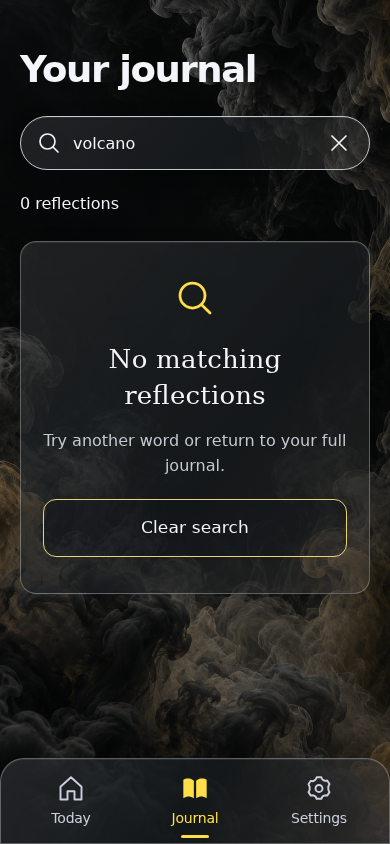

**Verifications:**

- [x] The expected result of this action is visible
- [x] Screenshot matches the committed baseline (zero differing pixels)

## Clear the search

**Verifications:**

- [x] The expected result of this action is visible
- [x] Screenshot matches the committed baseline (zero differing pixels)

## Open the latest reflection

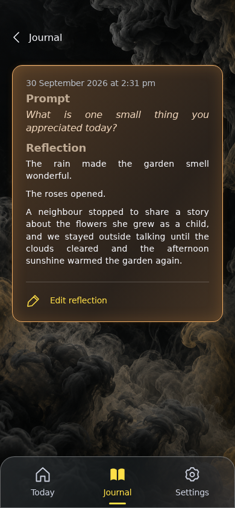

**Verifications:**

- [x] The expected result of this action is visible
- [x] Screenshot matches the committed baseline (zero differing pixels)

## Edit the saved reflection

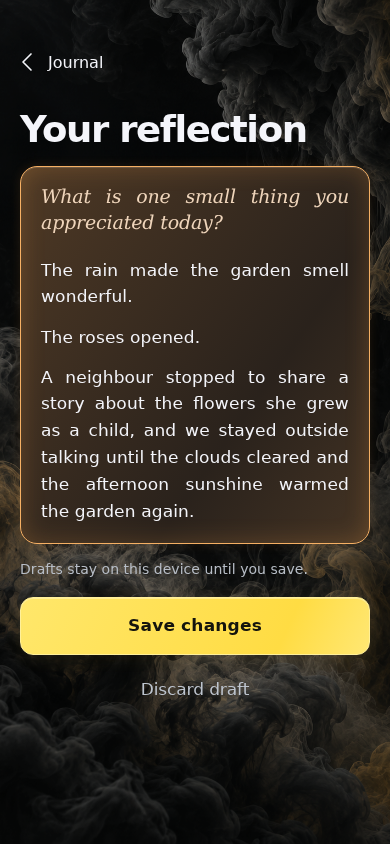

**Verifications:**

- [x] The expected result of this action is visible
- [x] Screenshot matches the committed baseline (zero differing pixels)

## Add a remembered detail

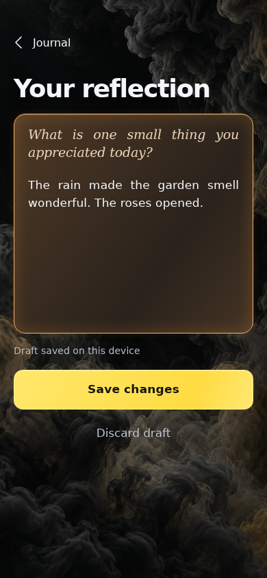

**Verifications:**

- [x] The expected result of this action is visible
- [x] Screenshot matches the committed baseline (zero differing pixels)

## Save changes to the existing reflection

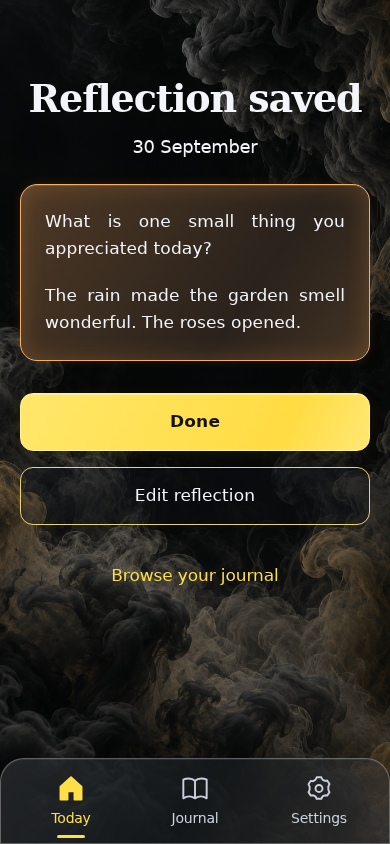

**Verifications:**

- [x] The expected result of this action is visible
- [x] Screenshot matches the committed baseline (zero differing pixels)

## Open Journal

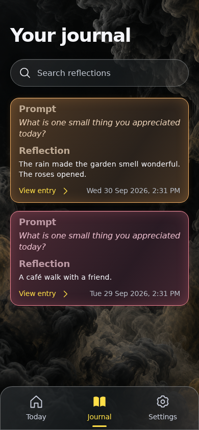

**Verifications:**

- [x] The expected result of this action is visible
- [x] Screenshot matches the committed baseline (zero differing pixels)
