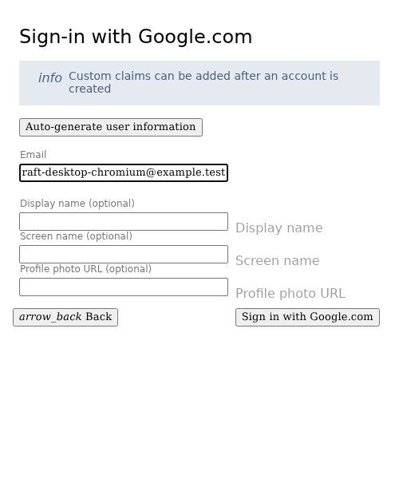
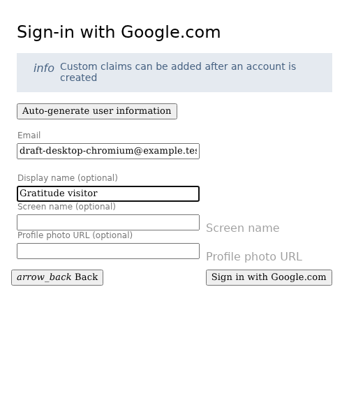
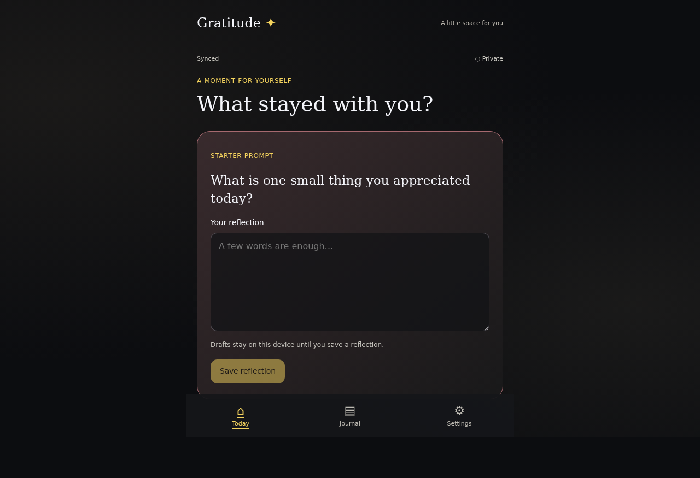
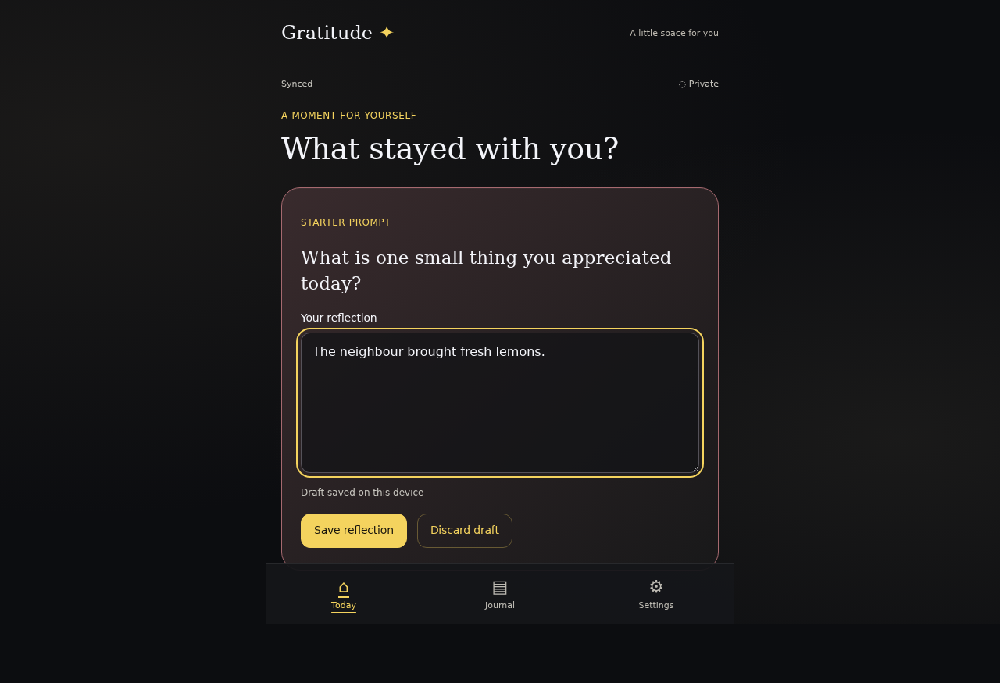
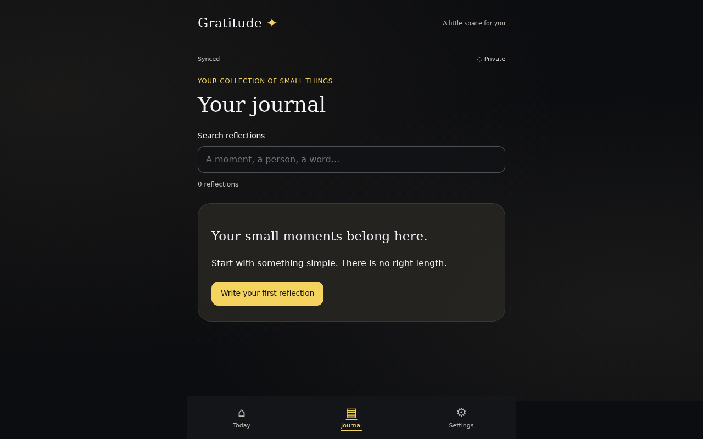
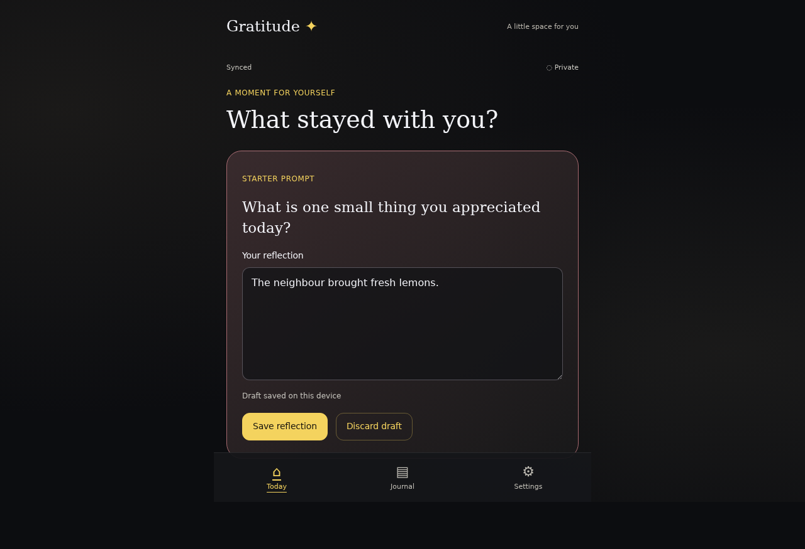
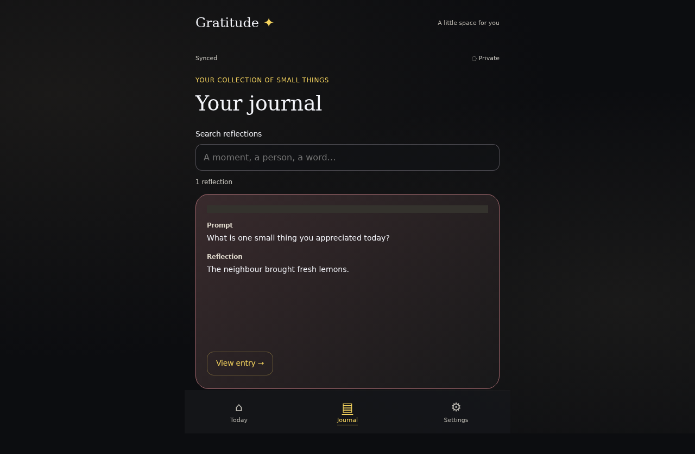
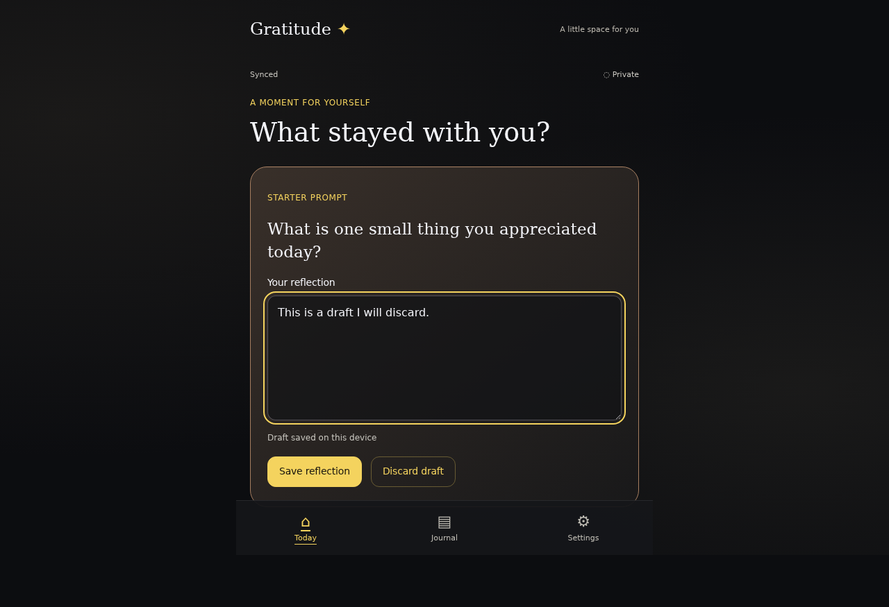
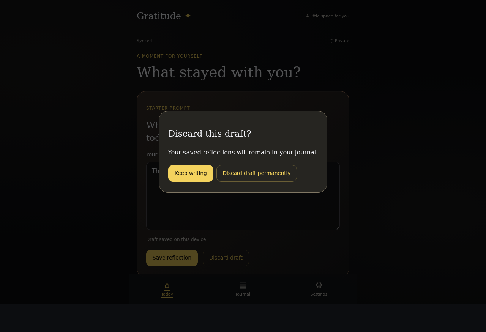

<!-- Generated by the E2E test. Do not edit by hand. -->

# Protect unfinished writing

Draft actions are persisted to this device independently of the confirmed cloud journal. Every interaction is captured. Saving uses a stable action ID to recover safely across interrupted acknowledgements.

Viewport: desktop-chromium.

## Open Gratitude

**Verifications:**

- [x] The expected result of this action is visible
- [x] Screenshot matches the committed baseline (zero differing pixels)

## Choose Google sign-in

**Verifications:**

- [x] The Google emulator account chooser opens
- [x] Screenshot matches the committed baseline (zero differing pixels)

## Add a fictional Google account

**Verifications:**

- [x] The account form opens
- [x] Screenshot matches the committed baseline (zero differing pixels)

## Enter the fictional email address

**Verifications:**

- [x] The email field retains the input
- [x] Screenshot matches the committed baseline (zero differing pixels)

## Enter a display name

**Verifications:**

- [x] The display name is entered
- [x] Screenshot matches the committed baseline (zero differing pixels)

## Complete sign-in and open Today

**Verifications:**

- [x] The private journal is synchronized
- [x] Screenshot matches the committed baseline (zero differing pixels)

## Begin an unfinished reflection

**Verifications:**

- [x] The expected result of this action is visible
- [x] Screenshot matches the committed baseline (zero differing pixels)

## Visit the journal without saving an entry

**Verifications:**

- [x] The expected result of this action is visible
- [x] Screenshot matches the committed baseline (zero differing pixels)

## Return to the unfinished draft

**Verifications:**

- [x] The expected result of this action is visible
- [x] Screenshot matches the committed baseline (zero differing pixels)

## Reload the application

**Verifications:**

- [x] The expected result of this action is visible
- [x] Screenshot matches the committed baseline (zero differing pixels)

## Ask to discard the draft

**Verifications:**

- [x] The expected result of this action is visible
- [x] Screenshot matches the committed baseline (zero differing pixels)

## Keep writing instead

**Verifications:**

- [x] The expected result of this action is visible
- [x] Screenshot matches the committed baseline (zero differing pixels)

## Save the recovered draft as one reflection

**Verifications:**

- [x] The expected result of this action is visible
- [x] Screenshot matches the committed baseline (zero differing pixels)

## Reload after saving

**Verifications:**

- [x] The expected result of this action is visible
- [x] Screenshot matches the committed baseline (zero differing pixels)

## Start another draft

**Verifications:**

- [x] The expected result of this action is visible
- [x] Screenshot matches the committed baseline (zero differing pixels)

## Open discard confirmation

**Verifications:**

- [x] The expected result of this action is visible
- [x] Screenshot matches the committed baseline (zero differing pixels)

## Confirm permanent draft removal

**Verifications:**

- [x] The expected result of this action is visible
- [x] Screenshot matches the committed baseline (zero differing pixels)

## Reload to verify the draft stays discarded

**Verifications:**

- [x] The expected result of this action is visible
- [x] Screenshot matches the committed baseline (zero differing pixels)
