<!-- Generated by the E2E test. Do not edit by hand. -->

# Take your journal with you

Downloads read a complete immutable event prefix from Firestore, independent of search and local drafts. The test inspects actual Markdown and JSON files and demonstrates the offline error. Every action has a screenshot.

Viewport: desktop-chromium.

## Open Gratitude

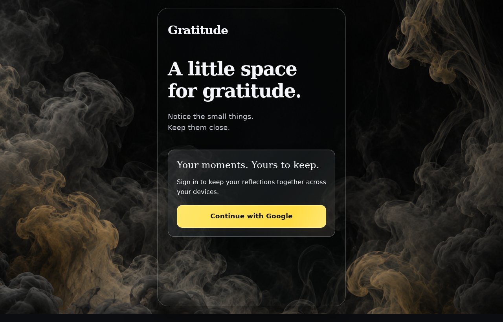

**Verifications:**

- [x] The expected result of this action is visible
- [x] Screenshot matches the committed baseline (zero differing pixels)

## Choose Google sign-in

**Verifications:**

- [x] The Google emulator account chooser opens
- [x] Screenshot matches the committed baseline (zero differing pixels)

## Add a fictional Google account

**Verifications:**

- [x] The account form opens
- [x] Screenshot matches the committed baseline (zero differing pixels)

## Enter the fictional email address

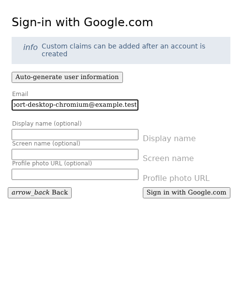

**Verifications:**

- [x] The email field retains the input
- [x] Screenshot matches the committed baseline (zero differing pixels)

## Enter a display name

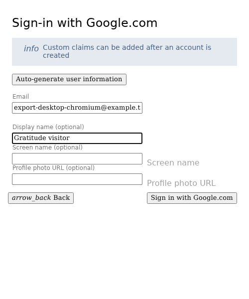

**Verifications:**

- [x] The display name is entered
- [x] Screenshot matches the committed baseline (zero differing pixels)

## Complete sign-in and open Today

**Verifications:**

- [x] The private journal is synchronized and Today is ready
- [x] Screenshot matches the committed baseline (zero differing pixels)

## Open Journal

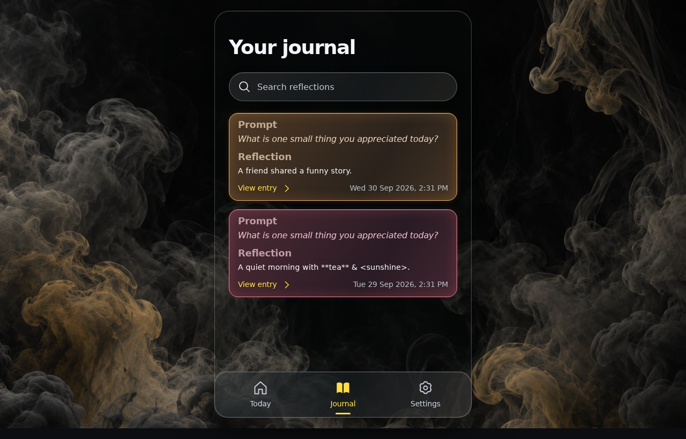

**Verifications:**

- [x] The expected result of this action is visible
- [x] Screenshot matches the committed baseline (zero differing pixels)

## Filter the visible journal to one entry

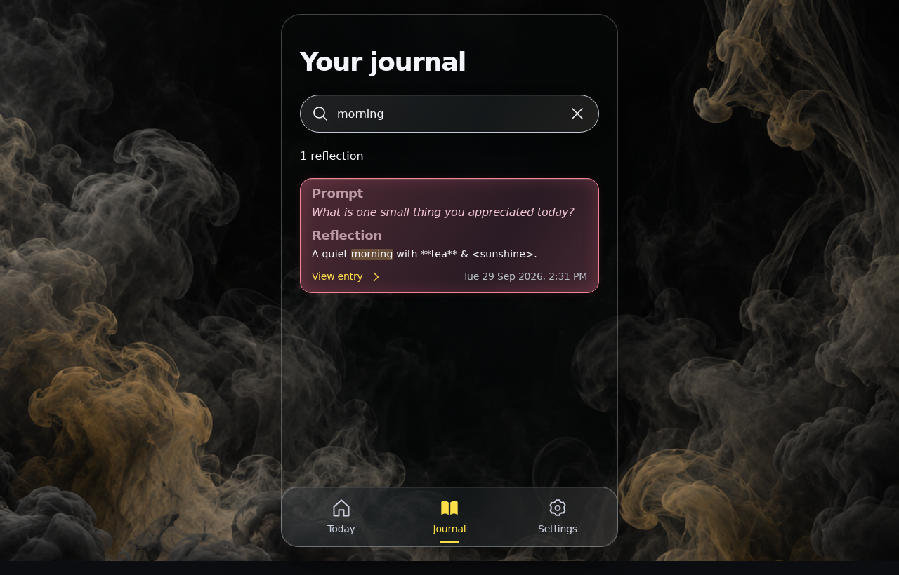

**Verifications:**

- [x] The expected result of this action is visible
- [x] Screenshot matches the committed baseline (zero differing pixels)

## Open Today

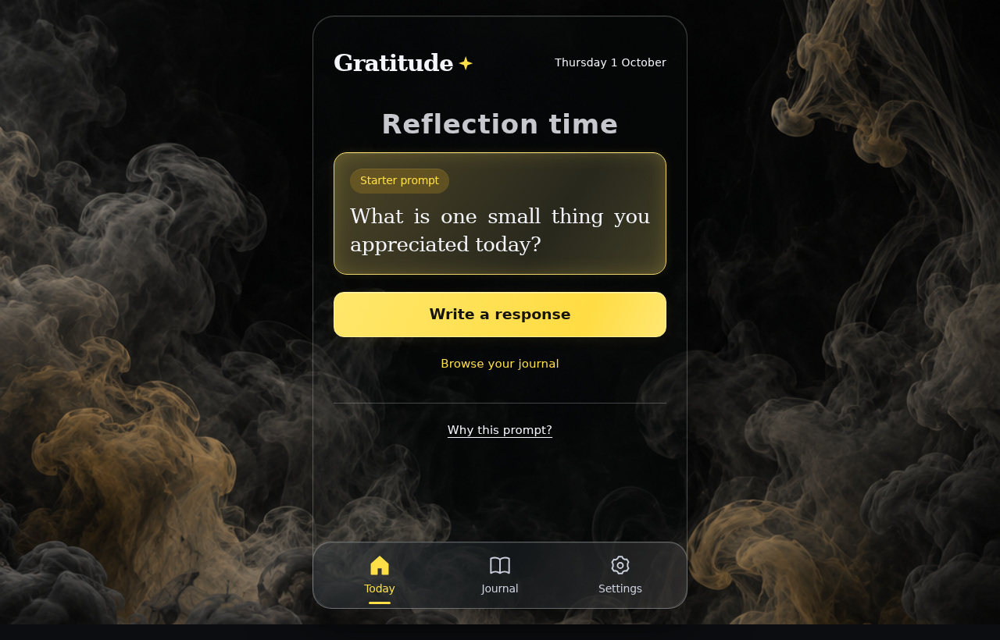

**Verifications:**

- [x] The expected result of this action is visible
- [x] Screenshot matches the committed baseline (zero differing pixels)

## Open the reflection editor

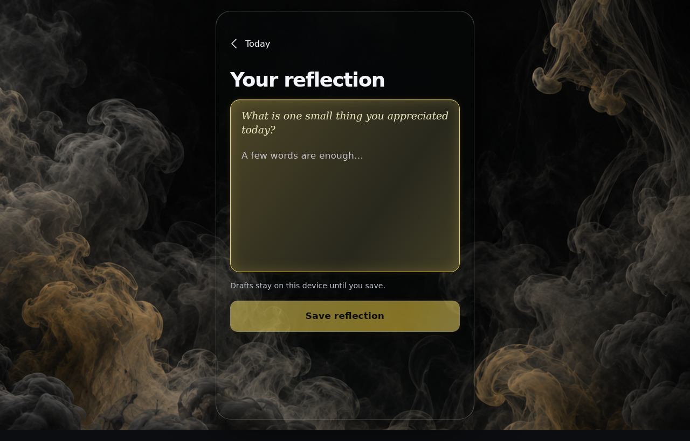

**Verifications:**

- [x] The expected result of this action is visible
- [x] Screenshot matches the committed baseline (zero differing pixels)

## Leave an unfinished draft

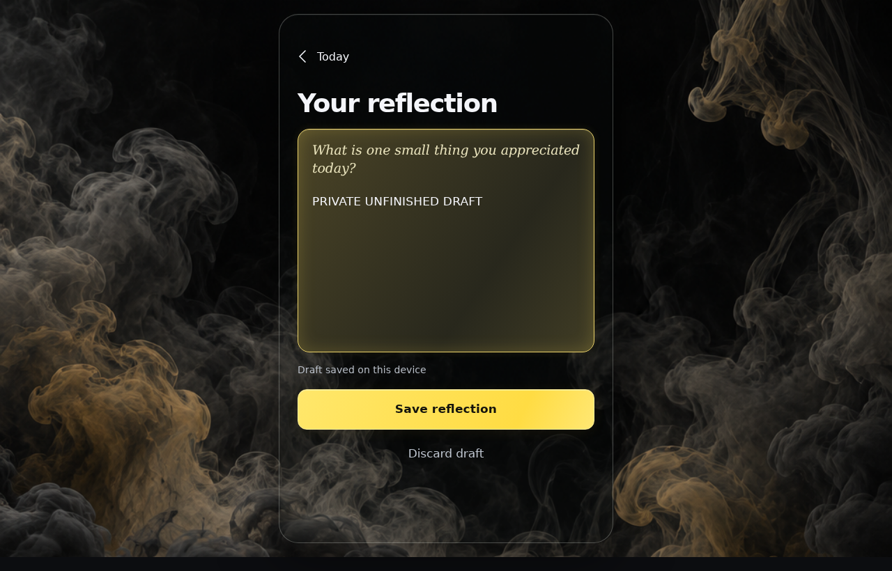

**Verifications:**

- [x] The expected result of this action is visible
- [x] Screenshot matches the committed baseline (zero differing pixels)

## Return to Today without losing the draft

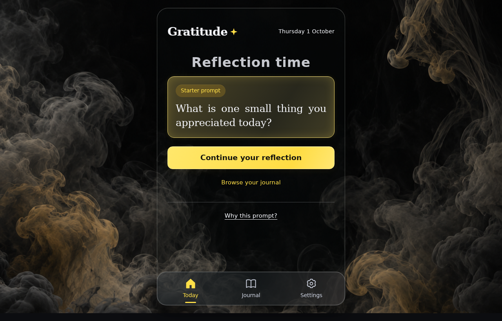

**Verifications:**

- [x] The expected result of this action is visible
- [x] Screenshot matches the committed baseline (zero differing pixels)

## Open Settings

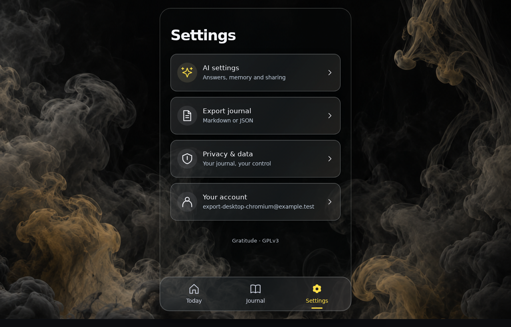

**Verifications:**

- [x] The expected result of this action is visible
- [x] Screenshot matches the committed baseline (zero differing pixels)

## Open export settings

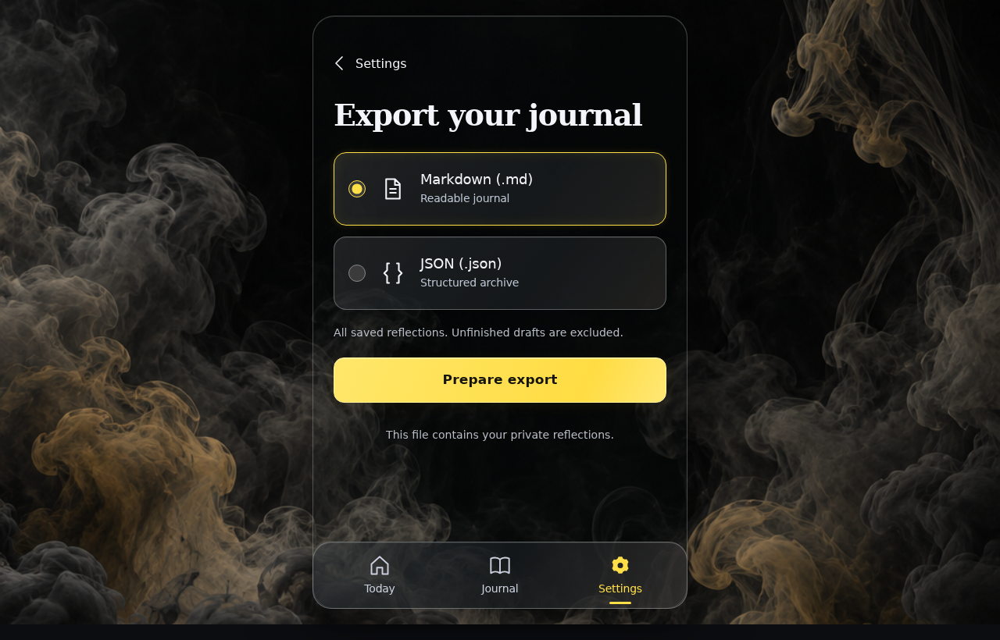

**Verifications:**

- [x] The expected result of this action is visible
- [x] Screenshot matches the committed baseline (zero differing pixels)

## Prepare a Markdown journal

**Verifications:**

- [x] The expected result of this action is visible
- [x] Screenshot matches the committed baseline (zero differing pixels)

## Download all saved reflections as Markdown

**Verifications:**

- [x] Markdown contains both saved entries in the requested format, without system metadata or unfinished drafts
- [x] Screenshot matches the committed baseline (zero differing pixels)

## Select JSON export

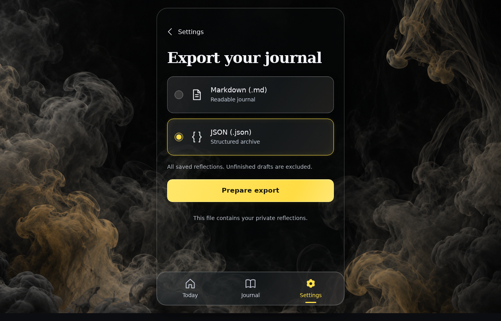

**Verifications:**

- [x] The expected result of this action is visible
- [x] Screenshot matches the committed baseline (zero differing pixels)

## Prepare a JSON archive

**Verifications:**

- [x] The expected result of this action is visible
- [x] Screenshot matches the committed baseline (zero differing pixels)

## Download the same journal as JSON

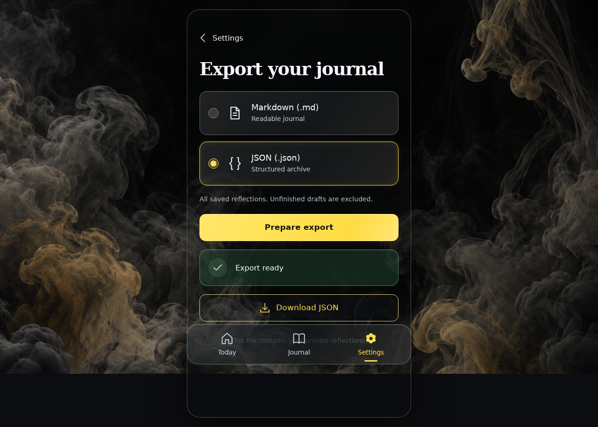

**Verifications:**

- [x] JSON keeps UTC instants; Markdown headings use Australia/Hobart local time
- [x] Screenshot matches the committed baseline (zero differing pixels)

## Disconnect before another export

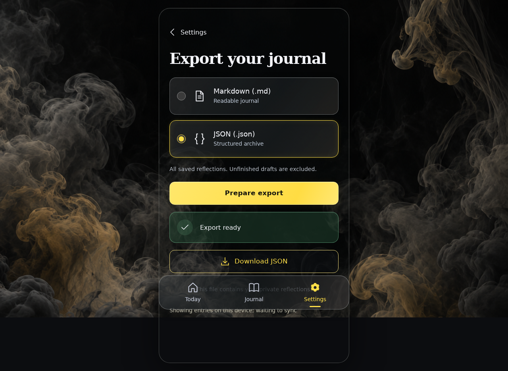

**Verifications:**

- [x] The expected result of this action is visible
- [x] Screenshot matches the committed baseline (zero differing pixels)

## Request a complete export while offline

**Verifications:**

- [x] The expected result of this action is visible
- [x] Screenshot matches the committed baseline (zero differing pixels)
