<!-- Generated by the E2E test. Do not edit by hand. -->

# Write paragraphs and review settings

A single Enter creates the same half-line paragraph spacing used in the journal. Plain-text clipboard input remains undoable and saves without HTML. Settings exposes AI controls with sharing disabled by default. Each user action has a screenshot comparison.

Viewport: desktop-chromium.

## Open Gratitude

**Verifications:**

- [x] Sign-in is available and the production build preserves the frosted glass blur
- [x] Screenshot matches the committed baseline (zero differing pixels)

## Choose Google sign-in

**Verifications:**

- [x] The Google emulator account chooser opens
- [x] Screenshot matches the committed baseline (zero differing pixels)

## Add a fictional Google account

**Verifications:**

- [x] The account form opens
- [x] Screenshot matches the committed baseline (zero differing pixels)

## Enter the fictional email address

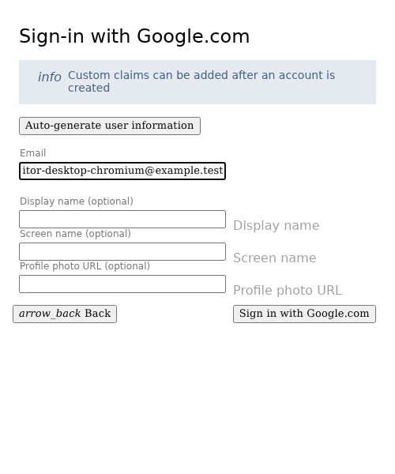

**Verifications:**

- [x] The email field retains the input
- [x] Screenshot matches the committed baseline (zero differing pixels)

## Enter a display name

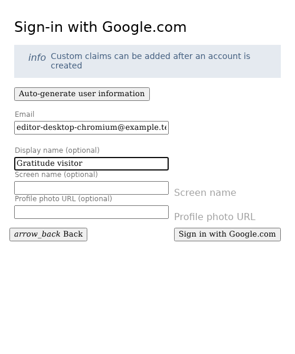

**Verifications:**

- [x] The display name is entered
- [x] Screenshot matches the committed baseline (zero differing pixels)

## Complete sign-in and open Today

**Verifications:**

- [x] The private journal is synchronized and Today is ready
- [x] The bottom navigation retains its 24px backdrop blur in the production build
- [x] Screenshot matches the committed baseline (zero differing pixels)

## Read why this starter prompt is shown

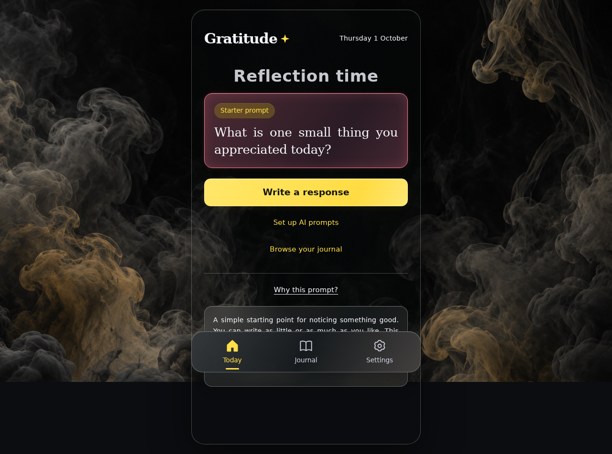

**Verifications:**

- [x] The expected result of this action is visible
- [x] Screenshot matches the committed baseline (zero differing pixels)

## Open the reflection editor

**Verifications:**

- [x] The expected result of this action is visible
- [x] Screenshot matches the committed baseline (zero differing pixels)

## Write the first paragraph

**Verifications:**

- [x] The expected result of this action is visible
- [x] Screenshot matches the committed baseline (zero differing pixels)

## Start a new paragraph with one Enter

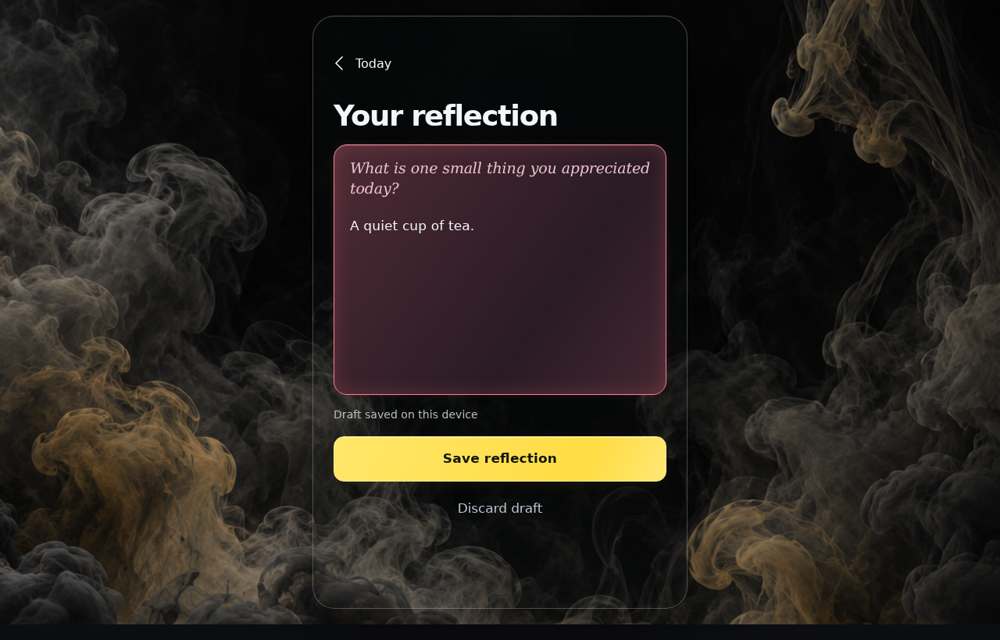

**Verifications:**

- [x] The expected result of this action is visible
- [x] Screenshot matches the committed baseline (zero differing pixels)

## Write the next paragraph with half-line spacing

**Verifications:**

- [x] The expected result of this action is visible
- [x] Screenshot matches the committed baseline (zero differing pixels)

## Paste another paragraph as plain text

**Verifications:**

- [x] The expected result of this action is visible
- [x] Screenshot matches the committed baseline (zero differing pixels)

## Undo the paste

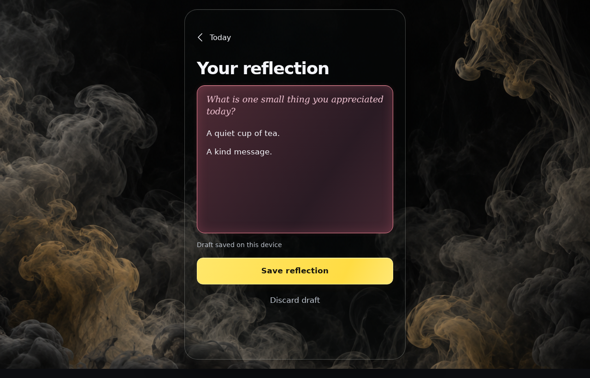

**Verifications:**

- [x] The expected result of this action is visible
- [x] Screenshot matches the committed baseline (zero differing pixels)

## Restore the pasted paragraph

**Verifications:**

- [x] The expected result of this action is visible
- [x] Screenshot matches the committed baseline (zero differing pixels)

## Save the paragraph-spaced reflection

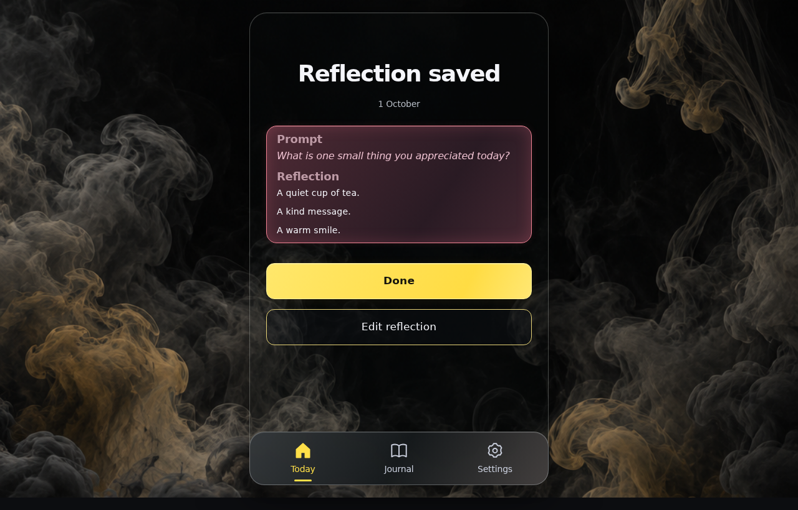

**Verifications:**

- [x] The saved card has matching Prompt and Reflection headings, an italic prompt, spaced paragraphs and no redundant browse button
- [x] Screenshot matches the committed baseline (zero differing pixels)

## Finish saving and open the journal

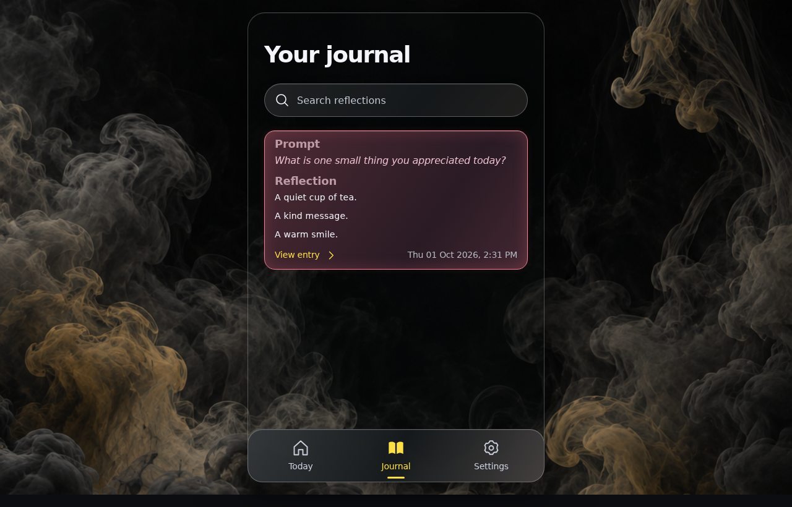

**Verifications:**

- [x] The expected result of this action is visible
- [x] Screenshot matches the committed baseline (zero differing pixels)

## Read the same paragraph layout in the full entry

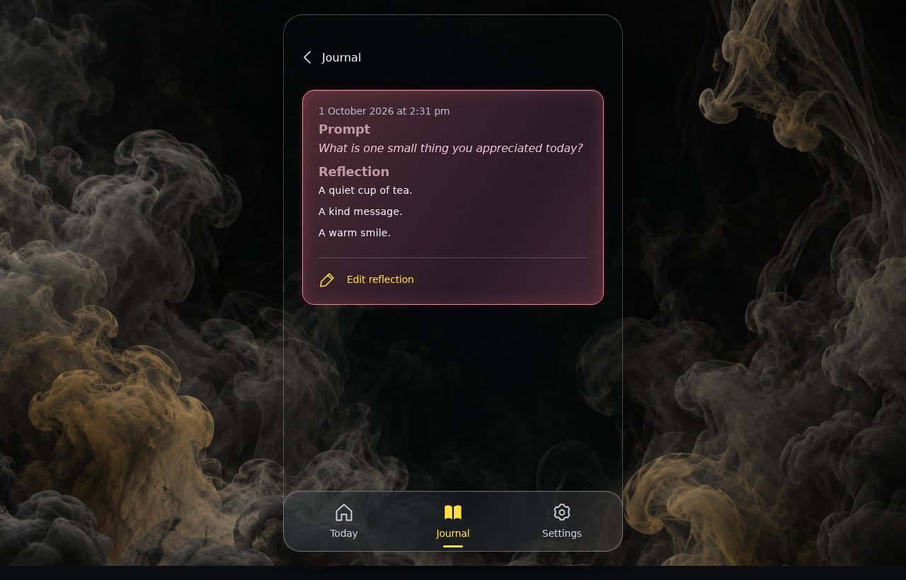

**Verifications:**

- [x] The expected result of this action is visible
- [x] Screenshot matches the committed baseline (zero differing pixels)

## Continue the saved reflection

**Verifications:**

- [x] The expected result of this action is visible
- [x] Screenshot matches the committed baseline (zero differing pixels)

## Move the caret to the end

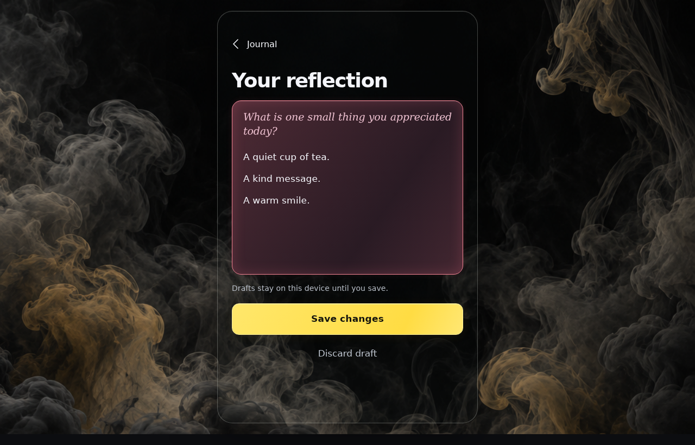

**Verifications:**

- [x] The expected result of this action is visible
- [x] Screenshot matches the committed baseline (zero differing pixels)

## Start another paragraph

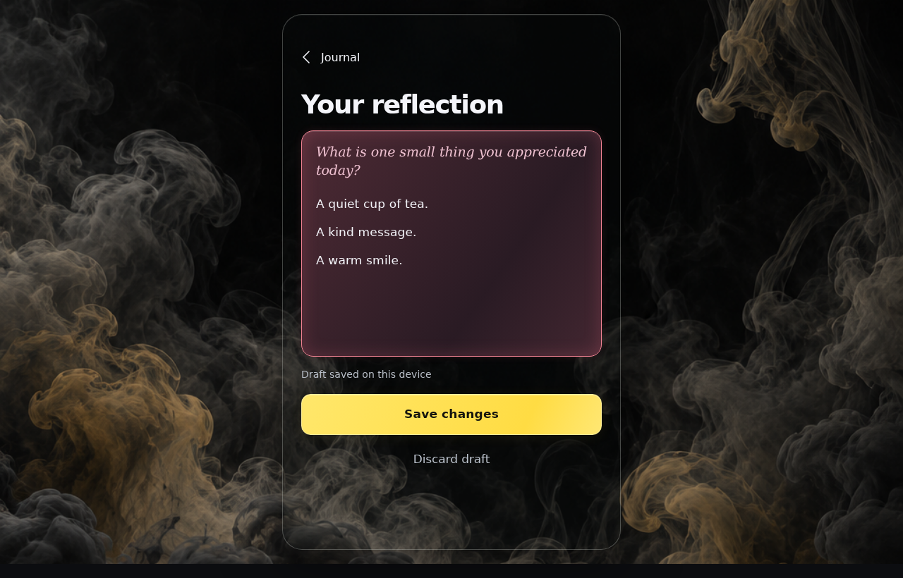

**Verifications:**

- [x] The expected result of this action is visible
- [x] Screenshot matches the committed baseline (zero differing pixels)

## Leave an intentional blank paragraph

**Verifications:**

- [x] The expected result of this action is visible
- [x] Screenshot matches the committed baseline (zero differing pixels)

## Write after the blank paragraph

**Verifications:**

- [x] The expected result of this action is visible
- [x] Screenshot matches the committed baseline (zero differing pixels)

## Save without adding extra blank lines

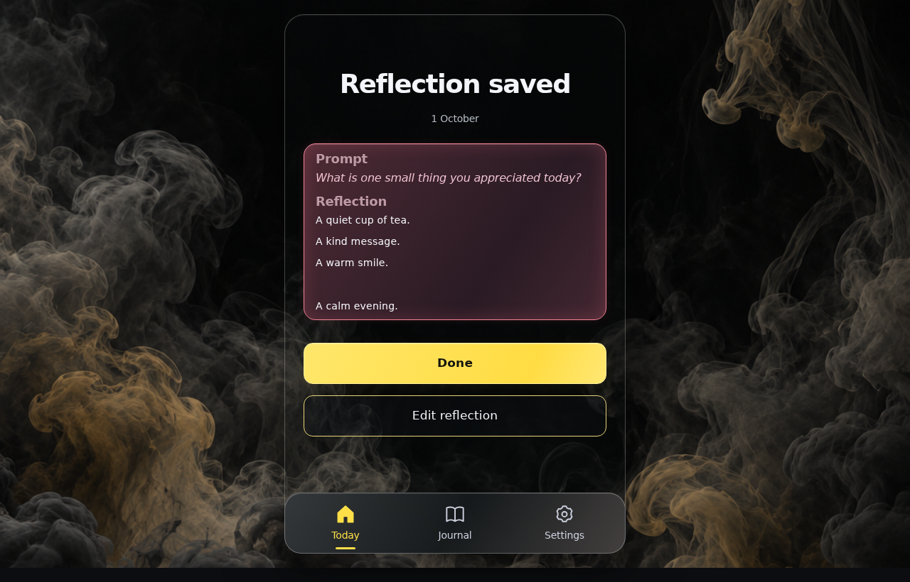

**Verifications:**

- [x] The expected result of this action is visible
- [x] Screenshot matches the committed baseline (zero differing pixels)

## Reopen the saved paragraphs

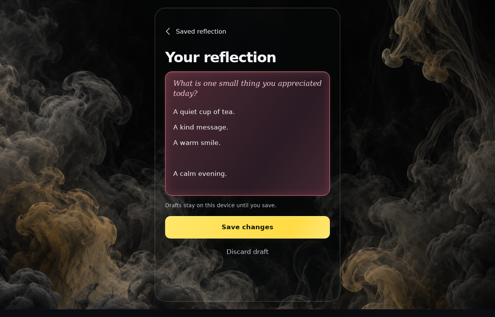

**Verifications:**

- [x] The expected result of this action is visible
- [x] Screenshot matches the committed baseline (zero differing pixels)

## Return to Saved reflection without losing the draft

**Verifications:**

- [x] The expected result of this action is visible
- [x] Screenshot matches the committed baseline (zero differing pixels)

## Open Settings

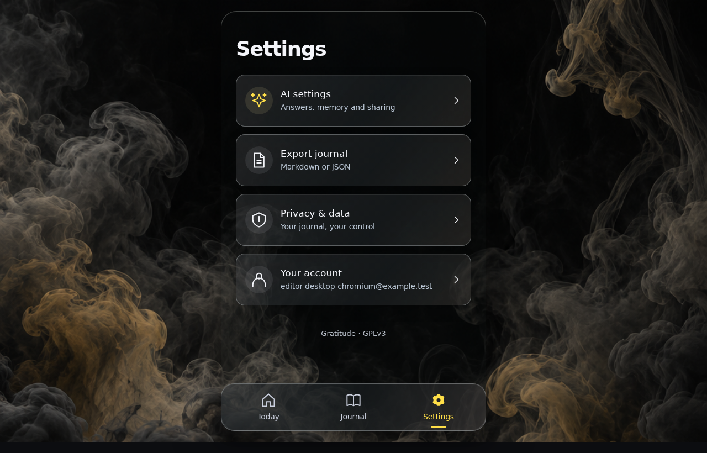

**Verifications:**

- [x] The expected result of this action is visible
- [x] Screenshot matches the committed baseline (zero differing pixels)

## Open AI settings from the Settings menu

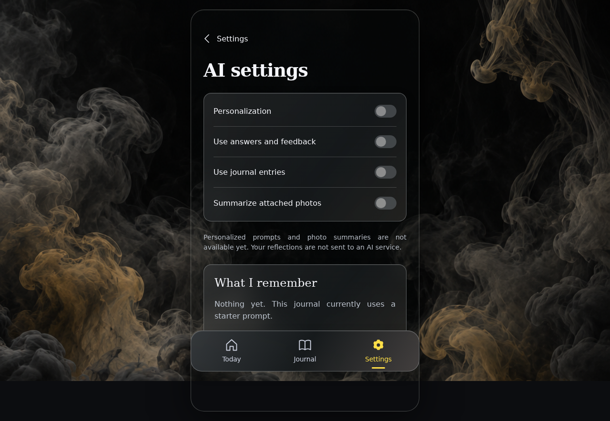

**Verifications:**

- [x] AI controls start off and require explicit choices before sharing
- [x] Screenshot matches the committed baseline (zero differing pixels)

## Return with the shared compact back control

**Verifications:**

- [x] The expected result of this action is visible
- [x] Screenshot matches the committed baseline (zero differing pixels)
