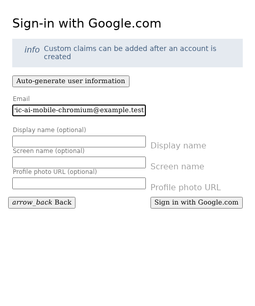
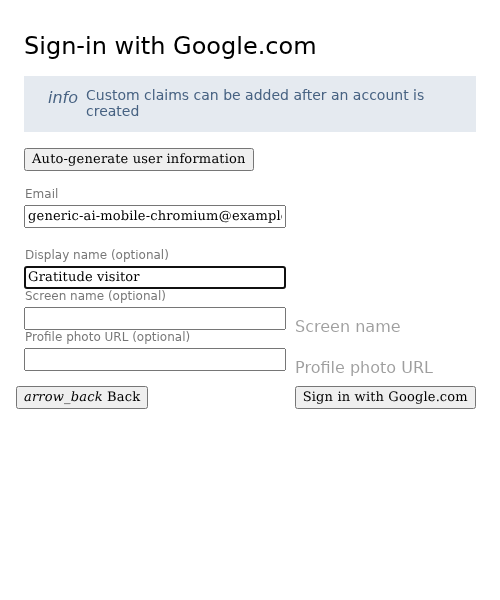
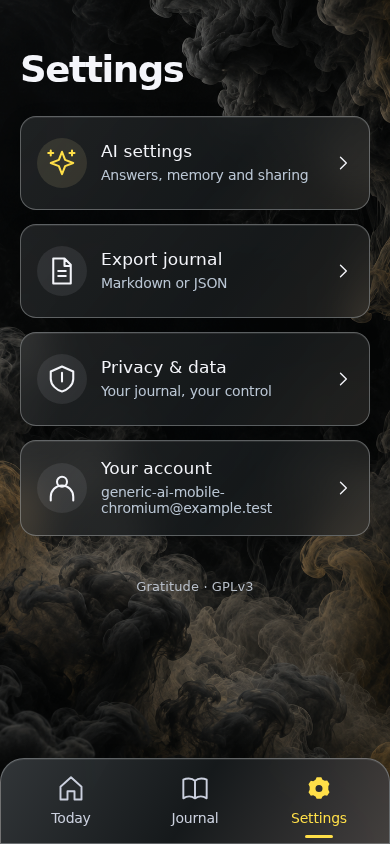
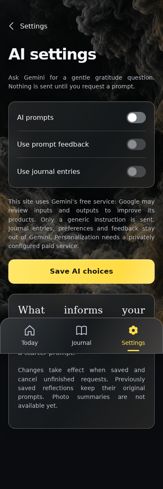
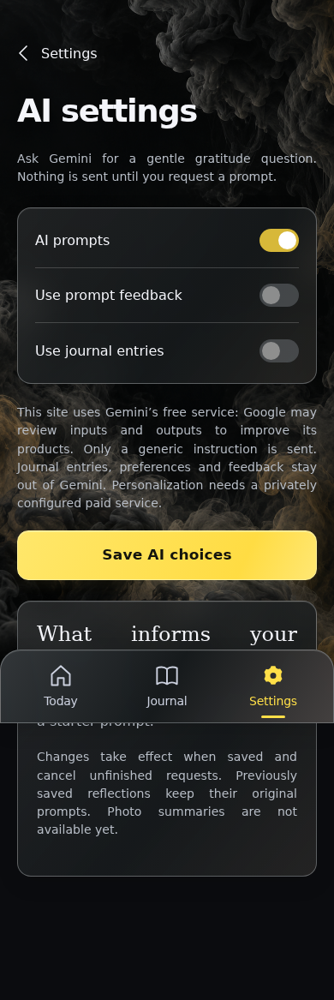
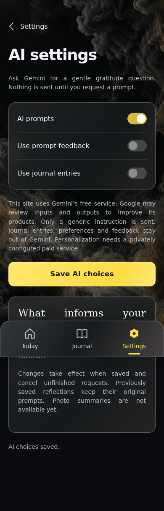
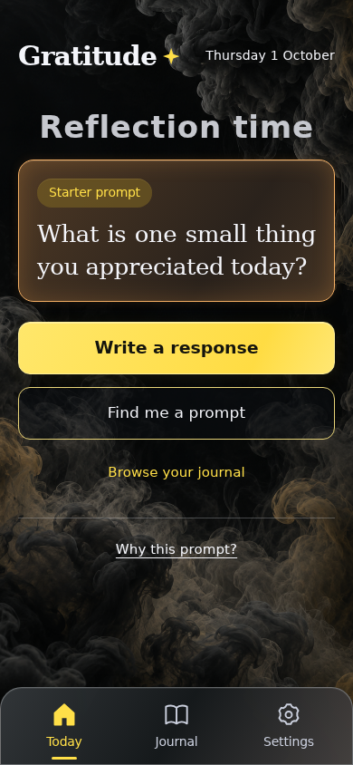
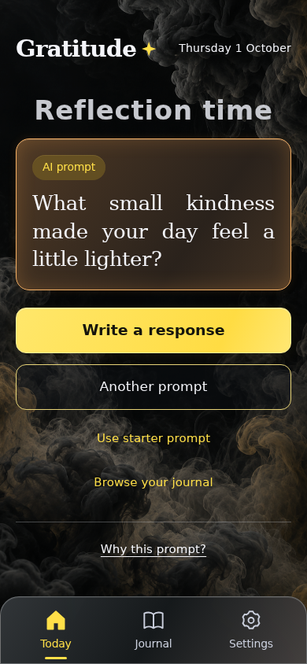
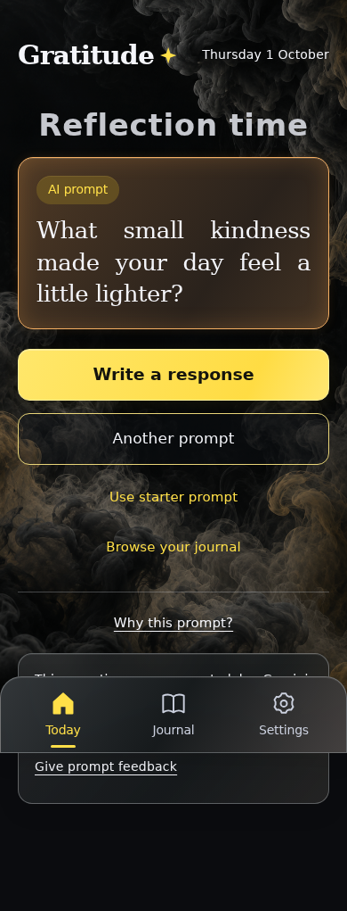

<!-- Generated by the E2E test. Do not edit by hand. -->

# Generic AI without journal sharing

This build uses the same generic data mode as the live sites, with Firebase emulators and a fictional provider response. Personal sharing controls are disabled; the outgoing model request contains no journal content.

Viewport: mobile-chromium.

## Open Gratitude

**Verifications:**

- [x] Sign-in is available and the production build preserves the frosted glass blur
- [x] Screenshot matches the committed baseline (zero differing pixels)

## Choose Google sign-in

**Verifications:**

- [x] The Google emulator account chooser opens
- [x] Screenshot matches the committed baseline (zero differing pixels)

## Add a fictional Google account

**Verifications:**

- [x] The account form opens
- [x] Screenshot matches the committed baseline (zero differing pixels)

## Enter the fictional email address

**Verifications:**

- [x] The email field retains the input
- [x] Screenshot matches the committed baseline (zero differing pixels)

## Enter a display name

**Verifications:**

- [x] The display name is entered
- [x] Screenshot matches the committed baseline (zero differing pixels)

## Complete sign-in and open Today

**Verifications:**

- [x] The private journal is synchronized and Today is ready
- [x] The bottom navigation retains its 24px backdrop blur in the production build
- [x] Screenshot matches the committed baseline (zero differing pixels)

## Open Settings

**Verifications:**

- [x] The expected result of this action is visible
- [x] Screenshot matches the committed baseline (zero differing pixels)

## Open AI sharing choices

**Verifications:**

- [x] The expected result of this action is visible
- [x] Screenshot matches the committed baseline (zero differing pixels)

## Choose to enable AI prompts

**Verifications:**

- [x] The expected result of this action is visible
- [x] Screenshot matches the committed baseline (zero differing pixels)

## Save these explicit sharing choices

**Verifications:**

- [x] The expected result of this action is visible
- [x] Screenshot matches the committed baseline (zero differing pixels)

## Open Today

**Verifications:**

- [x] The expected result of this action is visible
- [x] Screenshot matches the committed baseline (zero differing pixels)

## Request a prompt without personal context

**Verifications:**

- [x] Only the fixed generic instruction reaches the provider; the saved reflection is excluded
- [x] Screenshot matches the committed baseline (zero differing pixels)

## Read the generic prompt disclosure

**Verifications:**

- [x] The expected result of this action is visible
- [x] Screenshot matches the committed baseline (zero differing pixels)
